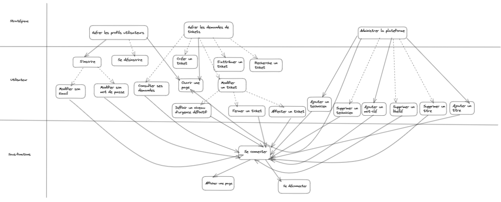

Florent VASSEUR--BERLIOUX, Tom BOGAERT, Assia GOUABI, Enzo GUIGNOLLE, Matthieu FARANDJIS 
INF2-A

# SAÉ S3  Cahier des charges

  
Ce document fait office de cahier des charges. Il rassemble toutes les informations importantes que nous devrons respecter pour mener à bien ce projet.

       

## Plan

### I – Objectif et portée
- <b>a) Quels sont la portée et les objectifs généraux ?</b>
- <b>b) Lecture du cahier des charges </b>
  - <u>i. Liste des objets, acteurs et actions </u>
  - <u>ii. Les différents niveaux </u>
  - <u>iii. Un schéma descriptif des niveaux </u>
### II – Terminologie employée / Glossaire
### III – Les cas d’utilisation
- <b>a) Les acteurs principaux et leurs objectifs généraux.</b>
- <b>b) Les cas d’utilisation métier (concepts opérationnels).</b>
- <b>c) Les cas d’utilisation système.</b>
### IV – La technologie employée
- <b>a) Quelles sont les exigences technologiques pour ce système ?</b>
- <b>b) Avec quels systèmes ce système s’interfacera-t-il et avec quelles exigences ?</b>
### V – Autres exigences
- <b>a) Processus de développement</b>
  - <u>i. Qui sont les participants au projet ?</u>
  - <u>ii. Quelles valeurs devront être privilégiées ? (exemple : simplicité, disponibilité, rapi-
dité, souplesse etc... )</u>
  - <u>iii. Quels retours ou quelle visibilité sur le projet les utilisateurs et commanditaires
souhaitent-ils ?</u>
  - <u>iv. Que peut-on acheter ? Que doit-on construire ? Qui sont nos concurrents ?</u>
  - <u>v. Quels sont les autres exigences du processus ? (exemple : tests, installation, etc...)</u>
  - <u>vi. À quelle dépendance le projet est-il soumis ?</u>
- <b>b) Règles métier</b>
- <b>c) Performances</b>
- <b>d) Opérations, sécurité, documentation</b>
- <b>e) Utilisation et utilisabilité</b>
- <b>f) Maintenance et portabilité</b>
- <b>g) Questions non résolues ou reportées à plus tard</b>
### VI – Recours humain, questions juridiques, politiques, organisationnelles.
- <b>a) Quel est le recours humain au fonctionnement du système ?</b>
- <b>b) Quelles sont les exigences juridiques et politiques ?</b>
- <b>c) Quelles sont les conséquences humaines de la réalisation du système ?</b>
- <b>d) Quels sont les besoins en formation ?</b>
- <b>e) Quelles sont les hypothèses et les dépendances affectant l’environnement humain ?</b>

       

------------------------------------------------------------------------------------------------------------------------
### I – Objectif et portée
- <b>a) Quels sont la portée et les objectifs généraux ?</b> 
  Le projet consiste à réaliser une application web permettant de récupérer les demandes de dépannage des utilisateurs
  dans les salles machines. En fonction des utilisateurs, l’application permet de voir les demandes,
  d’en créer ou de les gérer. Les demandes peuvent être classées en fonction de l’urgence qu’elle représente et seront
  archivés dans un journal. 
   
  La portée de l'utilisation de l'application s'arrête au réseau internet de l'IUT.
  L'application n'est pas utilisable en dehors de ce réseau. 
  Indépendamment de la communication entre le client et le serveur, la portée de l'application s'arrête au serveur du RaspberryPi 4.
  L'application n'a pas directement accès aux machines de l'IUT ou aux autres serveurs. Elle est indépendante. 
   
  On peut donc considérer le système comme boîte noire, puisqu'il s'adresse à différents acteurs comme les professeurs et les étudiants.
  Ce n'est pas un système purement interne ne concernant que les techniciens et les administrateurs. 
   

- <b>b) La lecture du cahier des charges </b>

  - i) Liste des objets, acteurs et actions

<table>
<colgroup>
<col span="1" style="background-color: dimgray">
<col span="1" style="background-color: darkslateblue">
<col span="1" style="background-color: rebeccapurple">

</colgroup>
<tr>
    <th>Objets</th>
    <th>Acteurs</th>
    <th>Actions</th>
</tr>
<tr>
    <td> Une application web (la plateforme)</td>
    <td> Client </td>
    <td> - Recueillir les demandes de dépannages   - Accueillir quatre types d'utilisateurs </td>
</tr>
<tr>
    <td> Le ticket (les demandes de dépannage)</td>
    <td> Des utilisateurs (étudiants et professeurs)</td>
    <td> - Afficher les différentes demandes (tickets) et leurs statuts   - Ouvrir un ticket   - Accéder à son tableau de bord et à son profil utilisateur </td>
</tr>
<tr>
    <td> Un formulaire d'inscription </td>
    <td> Un visiteur </td>
    <td> - Remplir un formulaire pour devenir utilisateur   - Accéder à la page d'accueil</td>
</tr>
<tr>
    <td> La base de données </td>
    <td> Un administrateur web </td>
    <td> - Se connecter   - Gérer la liste des libellés affectés aux différents problèmes   - Définir les statuts des tickets et leurs niveaux d'urgence   - Créer les comptes des techniciens et peut leur affecter des tickets   - Se déconnecter </td>
</tr>
<tr>
    <td> Le statut des tickets </td>
    <td> Des techniciens </td>
    <td> - Se connecter   - S'attribuer un ticket   - Changer le statut d'un ticket   - Se déconnecter </td>
</tr>
<tr>
    <td> Les journaux d'activité </td>
    <td> Un administrateur système </td>
    <td> - Accéder aux journaux d'activité   - Stocker des données de connexion infructueuse </td>
</tr>
<tr>
    <td> La page d'accueil </td>
    <td></td>
    <td> - Explique le but de la plateforme avec une vidéo de démonstration la présentant 
         - Afficher les 10 dernières demandes
    </td>
</tr>
<tr>
    <td> Un historique </td>
    <td></td>
    <td> - Stocker les tickets fermés </td>
</tr>
<tr>
    <td> Un tableau de bord </td>
    <td></td>
    <td> - Afficher la liste des tickets publiés et leur état</td>
</tr>
<tr>
    <td> La liste des libellés </td>
    <td></td>
    <td></td>
</tr>
<tr>
    <td> Les niveaux d'urgence des tickets </td>
    <td></td>
    <td></td>
</tr>
<tr>
    <td> Le système </td>
    <td></td>
    <td></td>
</tr>
<tr>
    <td> Un profil utilisateur </td>
    <td></td>
    <td> - Changer son mot de passe</td>
</tr>

</table>
 

- - ii) Les différents niveaux 

| Niveau stratégique (au-dessus de la mer)          | Niveau utilisateur (de la mer)                  | Niveau sous-fonctions (en-dessous de la mer) |
|---------------------------------------------------|-------------------------------------------------|----------------------------------------------|
| Stocker et répertorier des tickets                | Ouverture d'un ticket                           | Authentification                             |
| Enregistrer les utilisateurs                      | Se connecter ou déconnecter                     | Identifier un utilisateur                    |
| Gérer les profils utilisateurs                    | Modifier ou changer leur mot de passe           | Suivre leur actualité                        |
| Gérer l'inscription des visiteurs                 | Remplir un formulaire pour créer un utilisateur |                                              |
| Recueillir et afficher les demandes de dépannages | Consulter les demandes faites et leurs statuts  |                                              |
| Produire des statistiques sur les tickets         | Modification d'un libellé                       |                                              |
| Produire des statistiques sur les connexions      | Changer l'état d'un ticket                      |                                              |
|                                                   | Définir un niveau d'urgence                     |                                              |
|                                                   | Créer un compte technicien                      |                                              |
 

- - iii) Un schéma descriptif des niveaux 

       
------------------------------------------------------------------------------------------------------------------------
### II – Terminologie employée / Glossaire

Par ordre alphabétique.

| Mots                  | Définition                                                                                                                                                                                                                               |
|:----------------------|:-----------------------------------------------------------------------------------------------------------------------------------------------------------------------------------------------------------------------------------------|
| CNIL                  | Commission Nationale de l'Informatique et des Libertés. Autorité administrative indépendante française chargée de veiller notamment à ce que l’informatique soit au service du citoyen.                                                  |
| Connexion infructueuse | L'échec d'une tentative de connexion à un système ou à un compte utilisateur en raison d'informations incorrectes ou d'un problème technique.                                                                                            |
| Cookie                | (en informatique) : Petit fichier stocké par un serveur dans le terminal (ordinateur, téléphone, etc.) d’un utilisateur et associé à un domaine web.                                                                                     |
| Demande de dépannage  | Une requête soumise par un utilisateur pour signaler un problème ou une difficulté technique qui nécessite une intervention ou une résolution (Ticket) par l'équipe de support informatique.                                             |
| Injection SQL         | Technique permettant d’injecter des éléments de type SQL dans les champs des formulaires web ou dans les liens des pages afin de les envoyer au serveur web dans l'objectif de modifier des éléments présents dans une base de données. |
| Libellés              | Des étiquettes ou des mots-clés attribués à un ticket informatique pour catégoriser, organiser et faciliter la recherche des problèmes similaires ou des demandes de support.                                                            |
| RGPD                  | Règlement Général sur la Protection des Données. Texte de référence en matière de protection des données à caractère personnel. Il renforce et unifie la protection des données pour les individus au sein de l'Union européenne.        |
| RPi4                  | Raspberry Pi 4 un ordinateur monocarte de petite taille développé par la Fondation Raspberry Pi.                                                                                                                                         |
| Scenario ?            | Séquence d'actions qui se déroulent dans une situation donnée                                                                                                                                                                                                                                         |
| SGBD                  | Système de Gestion de Base de Données.                                                                                                                                                                                                   |
| Support informatique  | L'assistance technique qui réalise la gestion des demandes d'assistance, le dépannage des problèmes techniques, la résolution des questions liées à l'informatique.                                                                      |
| Tableau de bord       | Une interface en ligne qui affiche des informations récapitulatives et des données clés pour aider les utilisateurs à surveiller et à gérer les opérations liées aux tickets et au support informatique.                                 |
| Ticket                | Enregistre une tâche effectuée (ou qui doit être effectuée) par le système de support informatique afin de rectifier les problèmes, résoudre les demandes des clients.                                                                   |
| W3C                   | World Wide Web Consortium. Organisme international définissant les standards techniques liés au web et les règles à respecter pour tous les développeurs du monde.                                                                       |
| Wave                  | Extension de navigateur internet permettant d'évaluer l'accessibilité d'une page web pour les personnes souffrant d'handicap.                                                                                                           |

       
------------------------------------------------------------------------------------------------------------------------
### III – Les cas d’utilisation

- <b>a) Les acteurs principaux et leurs objectifs généraux.</b> 
   

  - <u>Le visiteur (un ou plusieurs) :</u> 
    > - S'inscrit
    > - Accède à la page d’accueil
    > - Consulte les 10 dernières demandes de dépannage
  
   
  Pour différencier un utilisateur d’un visiteur. Les visiteurs doivent s’inscrire, remplir un formulaire pour devenir utilisateur. 
   

  - <u>L’utilisateur (un ou plusieurs) :</u> 
    > - Se connecte, se déconnecte
    > - Ouvre un ticket
    > - Accède à son tableau de bord
    > - Accède à son profil
    > - Change son mot de passe
  
   

  - <u>Les techniciens (deux) :</u> 
    > - Est un utilisateur, mais avec plus de droit
    > - S'attribue ou affecte un ticket à un technicien
    > - Change l'état d'un ticket

   

  - <u>L’administrateur web (un seul) :</u> 

    > - Est un technicien, mais avec en plus des droits d'administration
    > - Affecte/Retire des libellés aux tickets
    > - Définis le statut des tickets
    > - Définis le niveau d'urgence d'un ticket
    > - Créer des comptes techniciens
    > - Résout les problèmes liés à l'authentification de l'utilisateur

   

  - <u>L’administrateur système (un seul) :</u> 
    > - Est un technicien, mais avec en plus des droits d'administration
    > - Accède et utilise les journaux d'activités

- <b>b) Les cas d’utilisation métier (concepts opérationnels).</b>
- <b>c) Les cas d’utilisation système.</b>

       
------------------------------------------------------------------------------------------------------------------------

### IV – La technologie employée
- <b>a) Quelles sont les exigences technologiques pour ce système ?</b>

  L'application devra utiliser : SQL, HTML, CSS et PHP 
  - SQL est le langage utilisé pour l'utilisation d'un SGBD comme MySQL 
  - HTML et CSS permettent la création des pages web du site internet. 
  - PHP permet de son côté de personnaliser les pages en fonction de l'utilisateur et des données de l'application. 

   
  MySQL est le Système de Gestion de Base de Données (SGBD) proposé par le client. 
   
  Nous utiliserons les logiciels PHPStorm, WebStorm de Jetbrains. 
  Ces outils ne sont pas contraints mais nous permettrons d’améliorer la qualité du code rendu. 
 

- <b>b) Avec quels systèmes ce système s’interfacera-t-il et avec quelles exigences ?</b>

  Afin de garantir le bon fonctionnement de l’application web finale, il faudra s’assurer que le serveur web soit prêt à l’utilisation sur une carte SD. 
  De plus, il sera nécessaire d’assurer le bon fonctionnement du site web sur les postes présents dans les salles machines de l’IUT de Vélizy. 
  La carte SD se devra de contenir un serveur web (Apache est conseillé) ainsi qu’un serveur SGBD. 
  Aussi, le serveur contenant l’application web sera porté sur Raspberry Pi 4 et sera accessible par connexion SSH. 

       
------------------------------------------------------------------------------------------------------------------------

### V – Autres exigences

- <b>a) Processus de développement</b>

  - <u>i. Qui sont les participants au projet ?</u> 

    Les membre de notre équipe sont les principaux participants au projet.
    Notre équipe est donc constituée de Tom BOGAERT, Matthieu FARANDJIS, Assia GOUABI, Enzo GUIGNOLLE et Florent VASSEUR--BERLIOUX. 
     
  - <u>ii. Quelles valeurs devront être privilégiées ? (exemple : simplicité, disponibilité,    rapidité, souplesse etc... )</u> 

    Nous priviligerons l'efficacité de nos algorithmes, mais egalement la sécurité de nos bases de données. Un point d'honeur sera egalement mis sur la disponibilité de notre application web et, plus généralement, sur sa simplicité de prise en main. 
     
  - <u>iii. Quels retours ou quelle visibilité sur le projet les utilisateurs et commanditaires
    souhaitent-ils ?</u> 

    Ce projet représentant un travail scolaire évalué, les commanditaires de ce projet sont nos enseignants. Ces derniers ont une grande visibilité sur l'avancée du projet et recevront à certaines dates des documents concernants le projet et son avancée. La communaction entre les membres de l'équipe et les enseignants est recommandée afin d'assurer le rendu d'un projet fidèle aux attentes de ces derniers. 
     
  - <u>iv. Que peut-on acheter ? Que doit-on construire ? Qui sont nos concurrents ?</u> 

    Le projet est de concevoir et programmer un site web de gestion de tickets. Aucun achat n'est nécessaire à la création de la plateforme web, puisque le matériel (RPi4) est pris en charge par le client.
    Nous ne possédons pas de concurrents à proprement parlé. 
     
  - <u>v. Quels sont les autres exigences du processus ? (exemple : tests, installation, etc...)</u> 

    Nous pouvons noter en exigences sur le projet, l'execution d'une phase de test assurant le bon fonctionnement de l'application. On attends egalement le rendu d'annexes concernant l'organisation du travail de l'equipe ou encore la charte graphique du logo de l'application. 
     
  - <u>vi. À quelle dépendance le projet est-il soumis ?</u> 

- <b>b) Règles métier</b> 

 

- <b>c) Performances</b> 

  Le site web se devra d'être le plus performent possible afind'en faciliter l'accés. Pour se faire, le programmes effectués en PHP seront optimisés et testés dans le but de limiter le nombre de boucles et d'actions. Les systèmes de stockages de données seront choisis en conséquences pour améliorer au mieux les performences de la plateforme.

 

- <b>d) Opérations, sécurité, documentation</b> 

  Tous le code étant utilisé pour mener le projet à bien se devra d'ête documenté afin d'assurer la lisibilité du programme. Toutes les fonctions générés seront accompagnées d'une Docstring.
  
  L'ensemble du programme sera egalement rendu impermeable au attaques de type Injection SQL. Le système sera protégé et restreindra les actions des utilisateurs afin de les empêcher de se détourner des indications de la plateforme web. Les mots de passes seront egalement encryptés. 

 

- <b>e) Utilisation et utilisabilité</b> 

  Nous veillerons à rendre l’application accessible en se basant sur la norme UAAG 2.1 de W3C. Nous utiliserons l'extension de navigateur internet "Wave" pour s'en assurer.

 

- <b>f) Maintenance et portabilité</b> 

  La portabilité de l'application web sera vérifier en passant par le validateur de W3C.

 

- <b>g) Questions non résolues ou reportées à plus tard</b> 

  La présence de Javascript n'étant pas demandée, nous ne prévoyons pas d'en utiliser sur les pages web. Cependant, nous nous octroyons la possibilité d'en faire usage si nécessaire lors de nos phases de conception et de programmation.
       
------------------------------------------------------------------------------------------------------------------------

### VI – Recours humain, questions juridiques, politiques, organisationnelles.
- <b>a) Quel est le recours humain au fonctionnement du système ?</b> 
  Le système fonctionnera en toute autonomie sur un serveur pour pouvoir être utilisé par les différents utilisateurs. 
  Le démarrage et la maintenance du système doivent être faits par du personnel qualifié comme l'administrateur système. 
   
  Si le système est capable d'inscrire de lui-même un visiteur du moment qu'il valide le captcha, ce n'est pas le cas pour les techniciens. 
  En effet, quand bien même il passe par la plateforme, l'administrateur web doit les inscrire de lui-même. 
  Il en va de même pour la réinitialisation de mot de passe en cas d'oubli. 
   
  L'application propose différentes actions pour les utilisateurs, qu'ils doivent actionner d'eux même. L'application ne fait que de les mettre en application. 
   
- <b>b) Quelles sont les exigences juridiques et politiques ?</b> 
  L'application se doit de respecter la loi française « Informatique et liberté » du 6 janvier 1978, mise à jour le 1er juin 2019, relative à l'informatique, aux fichiers et aux libertés. 
  L'application est également soumise au règlement européen « Règlement Général sur la Protection des Données » (RGPD) du 27 avril 2016, relatif à la protection des personnes physiques à l'égard du traitement des données à caractère personnel et à la libre circulation de ces données, et abrogeant la directive 95/46/CE. 
   
  A noter, la CNIL propose des recommandations vis à vis de la loi, notamment en matière de cookies. 
   
  Les articles peuvent être consultés via les liens ci-dessous :
  - <u>Loi « Informatique et liberté » :</u> 
    https://www.cnil.fr/fr/la-loi-informatique-et-libertes  
  - <u>Règlement européen « Règlement Général sur la Protection des Données » :</u> 
  https://www.cnil.fr/fr/reglement-europeen-protection-donnees  
  - <u>A propos des cookies :</u> 
  https://www.cnil.fr/fr/cookies-et-autres-traceurs/regles/cookies  
     

- <b>c) Quelles sont les conséquences humaines de la réalisation du système ?</b> 
  L'application permet l'amélioration de la gestion des dépannages dans les salles machines. 
  Les demandes seront prises en charge plus rapidement, et elles seront mieux répartie pour une résolution rapide et optimale. 
  Ses données sont utilisables dans le cas d'études statistiques ce qui permettrait de mieux organiser les révisions du matériel et la prévision du renouvellement du parc informatique. 
   
  Pour cela, notre application encourage la communication entre le personnel et les utilisateurs. 
  Elle encourage également l'implication des professeurs et étudiants dans la vie du parc informatique de l'établissement. 
   
  Ce qui aura pour effet une meilleure sollicitation des techniciens permettant d'alléger leurs plannings. 
  Grâce au matériel fonctionnel, les étudiants et professeurs pourront travailler dans de meilleures conditions et ainsi être plus joyeux et plus productif. 
  Pour les personnes souffrant de handicap, cela permettrait de les assurer qu'au moindre problème d'accessibilité, celui-ci sera résolu rapidement. 
   

- <b>d) Quels sont les besoins en formation ?</b> 
  En général, il est nécessaire de savoir se servir d'un ordinateur et d'un navigateur internet. 
   
  Un guide d'utilisation comprenant une vidéo de présentation pour apprendre à se servir de l'application sera disponible. 
  Celle-ci expliquera comment utiliser l'application comme pour faire une demande de dépannage. 
   
  On peut supposer une page web donnant des conseils pour les utilisateurs. Comme arrivé à estimer le niveau d'urgence d'une demande de dépannage afin de faciliter la tâche des administrateurs. 
   
  Dans tous les cas, l'établissement devra communiquer sur l'existence de l'application, le moyen d'y accéder et l'existence de ces aides. 
   

- <b>e) Quelles sont les hypothèses et les dépendances affectant l’environnement humain ?</b> 
  - Nous supposons que : 
    - tous les étudiants, professeurs et personnel concernés possède une connexion internet et savent se servir d'un ordinateur et d'un navigateur internet. 
    - le serveur contenant l'application sera toujours en ligne. 
    - l'utilisation de l'application par des personnes handicapées peut-être différente. 
    - l'établissement communiquera sur l'application afin de solliciter l'aide des professeurs et étudiants. 
   
  - L'application dépend de : 
    - la présence des techniciens et des administrateurs au sein de l'IUT.
      Si l'un d'eux se trouve indisponible, cela peut générer des retards dans la gestion des tickets. 
    - des lois françaises et celles de l'Union Européenne.
      Leur changement peut demander une réévaluation de l'application afin de s'assurer qu'elle soit toujours conforme.
    - l'évolution des navigateurs internet. L'application pouvant se retrouver obsolète.
    - l'implication et la réactivité des professeurs pour trouver et signaler des pannes.
