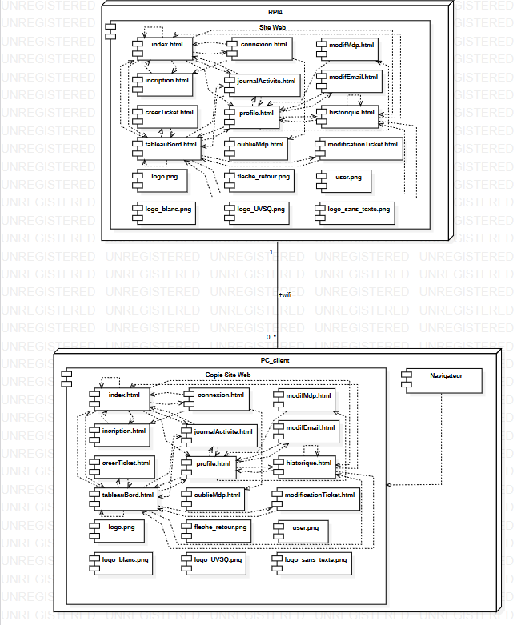

Florent VASSEUR--BERLIOUX, Tom BOGAERT, Assia GOUABI, Enzo GUIGNOLLE, Matthieu FARANDJIS 
INF2-A

# SAÉ S3  Dossier de conception

       

## Plan

### [I – Conception Détaillée](#p3)
- <b>[a) Conception de la page index.html ](#p1a)</b>
- <b>[b) Conception de la page connexion.html ](#p1b)</b>
- <b>[c) Conception de la page modifMdp.html ](#p1c)</b>
- <b>[d) Conception de la page inscription.html ](#p1d)</b>
- <b>[e) Conception de la page journalActivite.html ](#p1e)</b>
- <b>[f) Conception de la page modifEmail.html ](#p1f)</b>
- <b>[g) Conception de la page creerTicket.html ](#p1g)</b>
- <b>[h) Conception de la page profile.html ](#p1h)</b>
- <b>[i) Conception de la page historique.html ](#p1i)</b>
- <b>[j) Conception de la page tableauBord.html ](#p1j)</b>
- <b>[k) Conception de la page modificationTicket.html ](#p1k)</b>
- <b>[k) Recueil de fonctions ](#p1l)</b>

### [II – Conception Architectural](#p1)
- <b>[Figure 1 : Diagramme des composants ](#fg1)</b>

       

------------------------------------------------------------------------------------------------------------------------
### I – Conception Détaillée
  

- <b>a) Conception de la page index.html</b> 
  
<u>Programmation HTML :</u>
<pre>
La page index.html contient :
    Un 'nav' représentant la barre de naviguation. Ce 'nav' contient :
        Un 'div' représenant le logo du site.
        Un 'div' représentant les pages index.html; tableauBord.html; journalActivite.html; historique.html.
        Un 'div' représentant les boutons d'authentification menant vers connexion.html; incription.html; profil.html.
    Un 'section' représentant la partie présentation de la page. Ce 'section' contient :
        Un 'div' représentant le texte de présentation du site.
        Un 'div' représentant la vidéo de présentation du site.
    Un 'section' représentant la liste des dix derniers tickets. Ce 'section' contient :
        Un 'table' représentant le tableau contenant le tableau des tickets.
</pre>
  

- <b>b) Conception de la page connexion.php</b> 
  
<u>Programmation HTML :</u>
<pre>
La page connexion.html contient :
    Un 'div' représenant le bouton de retour à la page précédante.
    Un 'div' représentant le logo et le formulaire de connexion. Ce 'div' contient :
        Un 'form' représentant le formulaire de connexion.
</pre>
<u>Programmation PHP :</u>
<pre>
Lors de la validation du formulaire, les données de ce dernier sont envoyés vers la page d'action action_connexion.php :
- Vérification de la provenance des valeurs et de leur non nullité
{
    Lancement de la requête avec la fonction executeSQL()
    - Vérification de l'existance de l'utilisateur
    {
        Connexion au compte crée avec la fonction connectUser()
        Redirection vers tableauBord.html
    }
    Redirection connexion.php avec un id
}
Redirection connexion.php avec un id
</pre>
  

- <b>c) Conception de la page modifMdp.html</b> 
  
<u>Programmation HTML :</u>
<pre>
La page modifMDP.html contient :
    Un 'div' représenant le bouton de retour à la page précédante.
    Un 'div' représentant le logo et le formulaire de modification du mot de passe. Ce 'div' contient :
        Un 'form' représentant le formulaire de modification du mot de passe.
</pre>
  

- <b>d) Conception de la page inscription.php</b> 
  
<u>Programmation HTML :</u>
<pre>
La page inscription.html contient :
    Un 'div' représenant le bouton de retour à la page précédante.
    Un 'div' représentant le logo et le formulaire d'inscription. Ce 'div' contient :
        Un 'form' représentant le formulaire d'inscription.
</pre>
<u>Programmation PHP :</u>
<pre>
Lors de la validation du formulaire, les données de ce dernier sont envoyés vers la page d'action action_inscription.php :
- Vérification de la provenance des valeurs et de leur non nullité
{
    - Vérification de la conformité du format du mot de passe avec la fonction valideMDP()
    {
        Lancement de la requête avec la fonction executeSQL()
        - Vérification de la réussite de l'insertion de la requête
        {
            Création de l'utilisateur MariaDB et don de ses droits avec la fonction newUser()
            - Vérification de la création de l'utilisateur
            {
                Connexion au compte crée avec la fonction connectUser()
                Redirection vers tableauBord.html
            }
            Redirection inscription.php avec un id
        }
        Redirection inscription.php avec un id
    }
    Redirection inscription.php avec un id
}
Redirection inscription.php avec un id
</pre>
  

- <b>e) Conception de la page journalActivite.html</b> 
  
<u>Programmation HTML :</u>
<pre>
La page journalActivite.html contient :
    Un 'nav' représentant la barre de naviguation. Ce 'nav' contient :
        Un 'div' représenant le logo du site.
        Un 'div' représentant les pages index.html; tableauBord.html; journalActivite.html; historique.html.
        Un 'div' représentant le bouton d'accés au profil menant à profil.html.
    Un 'div' représentant les deux listes de journaux. Ce 'div' contient :
        Un 'div' représentant la liste des connexions infructueuses. Ce div contient :
            Un 'table' représentant le tableau des connexions.
        Un 'div' représentant la liste des tickets crées. Ce div contient :
            Un 'table' représentant le tableau des tickets.
    Un 'form' représentant le formulaire de télechargement des journaux.
</pre>
  

- <b>f) Conception de la page modifEmail.html</b> 
  
<u>Programmation HTML :</u>
<pre>
La page modifEmail.html contient :
    Un 'div' représenant le bouton de retour à la page précédante.
    Un 'div' représentant le logo et le formulaire de modification de l'email. Ce 'div' contient :
        Un 'form' représentant le formulaire de modification de l'email.
</pre>
  

- <b>g) Conception de la page creerTicket.html</b> 
  
<u>Programmation HTML :</u>
<pre>
La page creerTicket.html contient :
    Un 'div' représenant le bouton de retour à la page précédante.
    Un 'div' représentant le logo et le formulaire de création de tickets. Ce 'div' contient :
        Un 'form' représentant le formulaire de création de tickets.
</pre>
  

- <b>h) Conception de la page profile.html</b> 
  
<u>Programmation HTML :</u>
<pre>
La page profile.html contient :
    Un 'nav' représentant la barre de naviguation. Ce 'nav' contient :
        Un 'div' représenant le logo du site.
        Un 'div' représentant les pages index.html; tableauBord.html; journalActivite.html; historique.html.
        Un 'div' représentant le bouton de déconnexion.
    Un 'div' représentant la liste d'information du profil et la liste des tickets du profil. Ce 'div' contient :
        Un 'div' représentant la liste d'information du profil. Ce div contient :
            Un 'table' représentant le tableau des informations.
        Un 'div' représentant la liste des tickets du profil. Ce div contient :
            Un 'table' représentant le tableau des tickets.
</pre>
<u>Programmation PHP :</u>
<pre>
Lorsque le bouton de déconnexion est préssé, on active la page d'action action_inscription.php :
Ouverture session
Suppression des données de la session
Fermeture de la session
</pre>
<pre>
Le div représentant le profil contient des informations dynamiques, ce div est conçu ainsi :
Balises 'table' et 'tbody'
{
    Réccupération des données à afficher avec la fonction executeSQL()
    Boucle affichant chaque ligne du tableau (de 0 à 4)
    Initialisation de la constante INDEX étant une array contenant les premières données des lignes.
    {
        Balise 'tr'
        {
            Balise 'td'
            {
                Elément d'INDEX
            }
            Balise 'td'
            {
                Elément de la requête SQL
            }
            - Si l'itération de la boucle est de 2 ou 4
            {
                Balise 'td'
                {
                    Bouton de modification
                }
            }
        }
    }
}
</pre>
  

- <b>i) Conception de la page historique.html</b> 
  
<u>Programmation HTML :</u>
<pre>
La page historique.html contient :
    Un 'nav' représentant la barre de naviguation. Ce 'nav' contient :
        Un 'div' représenant le logo du site.
        Un 'div' représentant les pages index.html; tableauBord.html; journalActivite.html; historique.html.
        Un 'div' représentant le bouton d'accés au profil menant à profil.html.
    Un 'div' représentant la liste du contenu de l'historique. Ce 'div' contient :
        Un 'table' représentant le tableau de l'historique.
    Un 'form' représentant le formulaire de télechargement de l'historique.
</pre>
  

- <b>j) Conception de la page tableauBord.html</b> 
  
<u>Programmation HTML :</u>
<pre>
La page tableauBord.html contient :
    Un 'nav' représentant la barre de naviguation. Ce 'nav' contient :
        Un 'div' représenant le logo du site.
        Un 'div' représentant les pages index.html; tableauBord.html; journalActivite.html; historique.html.
        Un 'div' représentant le bouton d'accés au profil menant à profil.html.
    Un 'div' représentant les boutons de modification et de création de tickets.
    Un 'div' représentant la liste des tickets. Ce 'div' contient :
        Un 'table' représentant le tableau de bord.
    Un 'form' représentant le formulaire de recherche de tickets dans le tableau de bord.
</pre>
  

- <b>k) Conception de la page modificationTicket.html</b> 
  
<u>Programmation HTML :</u>
<pre>
La page modificationTicket.html contient :
    Un 'div' représenant le bouton de retour à la page précédante.
    Un 'div' représentant le logo et le formulaire de modification de tickets. Ce 'div' contient :
        Un 'form' représentant le formulaire de modification de tickets.
</pre>
  

- <b>b) Recueil de fonctions</b> 
  

#### <i>x = connectUser(a,b)</i>
<pre>
Tentative de connexion à la base de données avec l'identifiant de l'utilisateur et son mot de passe.
Si la connexion réussit, une session est créer et x = True. Sinon x = False.

x : bool (Définie l'état de la connexion à la base)
a : str (Correspond au login entré)
b : str (Correspond au mot de passe entré)
</pre>
#### <i>x = executeSQL(a,b,c)</i>
<pre>
Préparation de la requete sous la forme d'une requête préparé et envoie de cette dernière à la base de données.

x : string (Retour de la requête au près de la base de données)
a : str (Requête mySQL sous la forme d'une requête préparé avec des '?')
b : arraylist (Tableau des valeurs à inérer dans la requête dans l'ordre)
c : mysqli (Objet relatif à la connexion à la base de données)
</pre>
#### <i>x = newUser(a,b)</i>
<pre>
Création d'un nouvel utilisateur MariaDB, puis don de ses droits.
Si la fonction s'exécute correctement x = True. Sinon x = False.

x : bool (Définie l'état de la création de l'utilisateur)
a : str (Correspond au login entré)
b : str (Correspond au mot de passe entré)
</pre>
#### <i>x = valideMDP(a)</i>
<pre>
Vérifiaction de l'identité du mot de passe et de la confirmation du mot de passe. Vérification que le mot de passe respecte les normes de sécurité.
Si le mot de passe respecte les conditions de sécurité x = True. Sinon x = False.

x : bool (Définie la validité du mot de passe)
a : str (Correspond au mot de passe entré)
</pre>

------------------------------------------------------------------------------------------------------------------------
### I – Conception Architecturale
  

  
<i>Figure 1 : Diagramme de composants.</i>

La plateforme web est constitué de multiples pages (cf: spécification.md; les noms des pages de la plateforme web sont associés à leurs nom dans le dossier de spécification) :

    - index.html : La page "Page d'accueil".
    - connexion.html : La page "Page de réinitialisation de mot de passe (en maintenance)".
    - modifMdp.html : La page "Modification mot de passe".
    - incription.html : La page "Page d’inscription".
    - journalActivite.html : La page "Journal d’activité".
    - modifEmail.html : La page "Modification email".
    - creerTicket.html : La Page "Demande de dépannage".
    - profile.html : La page "Profil de l’utilisateur".
    - historique.html : La page "Historique des tickets".
    - tableauBord.html : La page "Tableau de bord ".
    - oublieMdp.html : La page "Oublie mot de passe".
    - modificationTicket.html : La page "Modification ticket".
    - logo.png : image du logo de l'application web.
    - fleche_retour.png : image de flèche de retour en arrière.
    - user.png : image de profil des utilisateurs.
    - logo_blanc.png : image du logo de l'application web en blanc.
    - logo_UVSQ.png : image du logo de l'UVSQ.
    - logo_sans_texte.png : image du logo de l'application web sans le texte.
