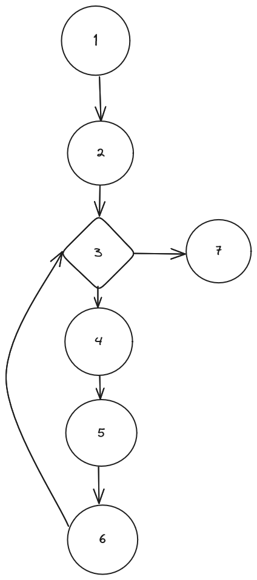

Florent VASSEUR--BERLIOUX, Tom BOGAERT, Assia GOUABI, Enzo GUIGNOLLE, Matthieu FARANDJIS<br>
INF2-A
<br>
<h1 style="color:red">Le 01/03/2024 en cours</h1><br>
<br>
<div align="center">


# SAÉ S3 - Dossier de test
## Site dynamique

<br><br>
Ce document permet de s'assurer que les focntions soit bien fonctionnel comme souhaité.

</div>

| Définition                         | Situation pour le test                                           |
|------------------------------------|------------------------------------------------------------------|
| Produit testé                      | Fonctions cryptographiques                                       |
| Configuration logicielle           | Firefox (118.0.1 et 64 bits) et<br/>Windows 10 (64 bits et 22H2) |
| Configuration matérielle           | Dell Optiplex 9020                                               |
| Date de début                      | 01/03/2024                                                       |
| Date de finalisation               | 01/03/2024                                                       |
| Test à appliquer                   | Boite noir, blanche - Tests unitaires                            |
| Responsable de la campagne de test | Toute l'équipe                                                   |


## Plan
- ### [I - Fonction convertionArrayDeBytesEnHexadecimal](#I)
- ### [II - Fonction KSA](#II)
- ### [III - Fonction rc4_chiffrement](#III)
  - ### [A - Introduction](#IIIA)
  - ### [B - Description de la procédure de test](#IIIB)
  - ### [C - Contexte des tests](#IIIC)
  - ### [D - Test boite blanche ](#IIID)
      - ### [a - Schéma des chemins indépendants](#IIIDa)
      - ### [b - Différents chemins](#IIIDb)
      - ### [c - conception des tests boite blanche](#IIIDc)
      - ### [d - exécution des tests boite blanche](#IIIDd)
  - ### [E - Test boite noire ](#IIIE)
  - ### [F - Avantages et inconvénients ](#IIIF)


<br><br><br><br><br><br><br>

#  <a name="I"></a> Fonction convertionArrayDeBytesEnHexadecimal

## Code de la fonction :

    function convertionArrayDeBytesEnHexadecimal($arr){            n° de bloc d'instruction
    
    $hex_str = "";                                                      1
    foreach ($arr as $byte)                                             2
    {
        if (is_int($byte)){                                             3
            $hex_str .= sprintf("%02X", $byte);                         4
        }
    }

    return $hex_str;                                                    5
    }

- ### Méthodologie employé
    Réalisation des tests unitaire en boite blanche et boite noir de cette fonction
    en appliquand pour le test boite blanche la méthode des chemins indépendant et
    pour les tests boite noir la métode des Partitions d'équivalance :

- ### Tests boîte blanche

    #### Graphe :

    <br>

    #### Chemins indépendants:
    
    ##### Les chemins
    
    C1 : 1 -> 2 -> 5<br>
    C2 : 1 -> 2 -> 3 -> 2 -> 5<br>
    C3 : 1 -> 2 -> 3 -> 4 -> 2 -> 5

    #### Donnée de test:

| Cas | array   | Sortie |
|-----|---------|--------|
| C1  | [ ]     | ""     |
| C2  | [ "a" ] | ""     |
| C3  | [ 2 ]   | "02"   |


- ### Tests boîte noir

    #### Partitions d'équivalences:
    
    #### Entrée
    
        A1 = array vide
        A2 = array non vide
        A3 = array non vide avec que des éléments non int
    
        A= A1 ∪ A2 ∪ A3
    
    #### Sortie
    
        S = chaine convertie
        E = chaine vide
        
        T = S ∪ E
    
    #### Cas de test:

| Partition | array | Sortie |
|-----------|-------|--------|
| P1        | A1    | E      |
| P2        | A2    | S      |
| P3        | A3    | E      |


#### Données de test:

| Partition | array   | Sortie |
|-----------|---------|--------|
| P1        | [ ]     | ""     |
| P2        | [ 2 ]   | "02"   |
| P3        | [ "a" ] | ""     |


#### Fonction de test de la fonction

    <?php

    function testConversionArrayDeBytesEnHexadecimal() {

        // Test case 1: Empty array
        $input3 = [];
        $expected3 = "";
        assert(convertionArrayDeBytesEnHexadecimal($input3) === $expected3);

        // Test case 2: Array non vide avec des éléments qui ne sont pas des int et des int
        $input2 = [97, "test", 255, "A"];
        $expected2 = "61FF";
        assert(convertionArrayDeBytesEnHexadecimal($input2) === $expected2);
    
        // Test case 3: Array non vide avec que des éléments non int
        $input4 = ["hello", true, 123.45];
        $expected4 = "";
        assert(convertionArrayDeBytesEnHexadecimal($input4) === $expected4);
    
        echo "Tous les tests on été passer avec succès!\n";
    }

    // Run la fonction de test
    testConversionArrayDeBytesEnHexadecimal();

    ?>


#### Comparaison test boite noir et boite blanche

Pour cette fonction les tests en boite blanche et en boite noir sont relativement identique, donc le test boite noir est préférable au test boite blanche
puisque le code est assez simpliste donc facile à réaliser de plus en cas de modification de l'algorithme cela n'engendrera pas une obligation de modification du test.

#### Execution du test
| Cas n° | Critère                                        | Résultat attendu | Résultat obtenu | Commentaire |
|:-------|------------------------------------------------|------------------|-----------------|-------------|
| 1      | Array vide                                     | ""               | ""              | OK          |         
| 2      | Array non vide                                 | "61FF"           | "61FF"          | OK          |
| 3      | Array non vide avec que des éléments non int   | ""               | ""              | OK          |


<br><br><br><br><br>

----------------

# <a name="II"></a> fonction KSA

- ### Méthodologie employé
Nous allons tester la fonction KSA à l'aide de tests boîtes blanche et noir.<br>
En premier lieu, nous allons trouver les différents chemin possible dans le code, et on vas vérifier le fonctionnement du code grâce aux tests boîtes blanche.<br>
Pour les tests boîtes noir, nous allons tester différentes valeurs.<br>
Cependant, au vu de la taille importante du résultat et de la complexité de l'algorithme, nous avons comparer avec des résultats trouvés en ligne.<br>
De plus, on s'assure que le caractère espace est bien pris en compte dans une chaîne, et que celle ci ne se résumerais pas au premier mot avant l'espace.<br>

- ### Tests boîte blanche
<br>
C1 = {0; 1; 3; 4; 5; 6; 7; 8}<br>
C2 = {0; 1; 2; 3; 4; 5; 6; 7; 8}<br>

| Cas | Entrée clefK  | Retour                           |
|-----|---------------|----------------------------------|
| C1  | ""            | Erreur : Modulo 0 pour la case 7 |
| C2  | "pomme"       | [112, 135, 79, ...]              |


- ### Tests boîte noir

| Cas | Entrée clefK       | Résultat obtenu                | Résultat attendu                  | Valide |
|-----|--------------------|--------------------------------|-----------------------------------|--------|
| 1   | ""                 | ERREUR : Modulo by zero        | ERREUR personnalisé : Clé absente | KO     |
| 2   | "Wiki"             | [256, 139, 160, 46, 154,  ...] | [256, 139, 160, 46, 154 ...]      | OK     |
| 3   | "Key"              | [75, 51, 132, 157, 192, ...]   | [75, 51, 132, 157, 192, ...]      | OK     |
| 4   | "Secret"           | [46, 181, 30, 147, 38, ...]    | [46, 181, 30, 147, 38, ...]       | OK     |
| 5   | "Wiki très secret" | [76, 145, 46, 115, 180, ...]   | [76, 145, 46, 115, 180, ...]      | OK     |

- ### Analyse de la pertinence de ces tests
ici débat avantage/inconvénient d'un test b noir/blanche pour ce test là

|               | Avantage                                               | Inconvénient                                                                                                                            |
|---------------|--------------------------------------------------------|-----------------------------------------------------------------------------------------------------------------------------------------|
| Boîte blanche | Plus facile à faire, on test simplement les conditions | Les cas sont limités au chemin étudiés qui correspondent à la validité ou non d'une condition.                                          |
| Boîte Noir    | On a la possibilité de faire plusieurs cas de tests    | Il est compliqué de deviner le résultat attendu sans utiliser un code déjà existant et fonctionnel : l'algorithme est long et complexe. |


<br><br><br><br><br>

----------------

# <a name="III"></a> fonction rc4_chiffrement


## <a name="IIIA"></a>I - Introduction

Durant les travaux pratiques en qualité de développement, nous avons pu réaliser des tests boites blanches et boites noires sur des méthodes des classes que nous avions conçu l'année passée. Cependant, lors de cette dernière séance, nous nous sommes rasssemblés en groupe afin de réaliser des tests boites blanches et noires sur le projet en cours de développement. Ainsi, dans ce dossier de test, nous avons pu effectuer des cas de tests pour la fonction rc4_chiffrement du fichier Cryptofunctions.php.
<br>

## <a name="IIIB"></a>II - Description de la procédure de test

Nous allons réaliser les tests boites blanches sur les méthodes Ajout et toString de la classe Planning qui ont été développées l’an passé en TP. Dans un premier temps, nous analysons et décortiquons la méthode en relevant les différentes conditions et instructions qui la compose. On réalise par la suite un schéma qui nous permet de visualiser et mieux comprendre la situation. Les conditions sont représentées par des losanges tandis que les instructions par des cercles. Ensuite, je définis les cycles visibles sur la figure. Enfin, nous terminons avec la conception et la réalisation des tests boites blanches.
<br>

## <a name="IIIC"></a>III - Contexte des tests

| Critères                    | Données                  |
|-----------------------------|--------------------------|
| Produit testé               | fonction rc4_chiffrement |
| Date de début               | 01/03/2024               |
| Date de finalisation        | 01/03/24                 |
| Responsable de la campagne  | Fteam                    |

<br><br><br>

----------

<br><br><br>

## Voici la fonction à tester


```

function rc4_chiffrement($clef, $texte){
    $S = KSA($clef);

    // Génération du texte chiffré
    $res = '';
    $i = 0;
    foreach (suite_chiffrante($S,strlen($texte)) as $k) {
        $nOctet = ord($texte[$i]) ^ $k;
        $res .= chr($nOctet);
        $i++;
    }

    return strtoupper(bin2hex($res));
}
```
## <a name="IIID"></a>IV - Test boite blanche

### <a name="IIIDa"></a>a - Schéma des chemins indépendants



### <a name="IIIDb"></a>b - Différents chemins

C1 = {1,2,3,7} <br>
C2 = {1,2,3,4,5,6,3,7}


### <a name="IIIDc"></a>c - Conception des tests boite blanche

| Chemin | Clef | texte | Résultat         |
|--------|------|-------|------------------|
| C1     | clé  | texte | char hexadécimal |
| C2     | clé  | vide  | null             |

### <a name="IIIDd"></a>d - Exécution des tests boite blanche

| Chemin | Clef  | texte       | Résultat           |
|--------|-------|-------------|--------------------|
| C1     | "Key" | "Plaintext" | BBF316E8D940AF0AD3 |
| C2     | "Key" | " "         | null               |

----------

<br><br><br>

## <a name="IIIE"></a>V - Test boite noire

### Conception des tests boîte noire

| Chemin | Clef | texte | Résultat attendu  |
|--------|------|-------|-------------------|
| P1     | clé  | court | char hexadécimal  |
| P2     | vide | court | $texte            |
| P3     | clé  | vide  | " "               |
| P4     | vide | vide  | " "               |
| P5     | clé  | long  | char héxadécimal  |
| P6     | vide | long  | $texte            |

### Execution des tests boîte noire

| Chemin | Clef     | texte            | Résultat attendu             | Résultat obtenu              | Validation |
|--------|----------|------------------|------------------------------|------------------------------|------------|
| P1     | "Key"    | "Plaintext"      | BBF316E8D940AF0AD3           | BBF316E8D940AF0AD3           |            |
| P2     | " "      | "Plaintext"      | "Plaintext"                  | "Plaintext"                  |            |
| P3     | "Key"    | " "              | " "                          | " "                          |            |
| P4     | " "      | " "              | " "                          | " "                          |            |
| P5     | "Secret" | "Attack at dawn" | 45A01F645FC35B383552544B9BF5 | 45A01F645FC35B383552544B9BF5 |            |
| P6     | " "      | "Attack at dawn" | "Attack at dawn"             | "Attack at dawn"             |            |

----------

<br><br><br>

## <a name="IIIF"></a>VI - Avantages et inconvénients

Avantages des tests boite noire : <br> Les tests boites noires sont plus stables face aux changements internes dans le code. Ainsi, si l'on modifie la fonction ça n'aura pas le même impact sur les tests que si c'était des tests boites blanches.
<br>
Nous n'avons pas besoin de nous soucier du code de la fonction pour réaliser les tests
<br><br>
Inconvénient des tests boite noire : <br> Plus de lignes de code sont à fournir
<br><br>
Avantage des tests boite blanche: <br> Nous pouvons facilement détecter les erreurs
<br><br>
Inconvénient des tests boite blanche : <br> Si nous sommes amener à modifier des parties du code, il faudra modifier les chemins, le schéma et les tests. 