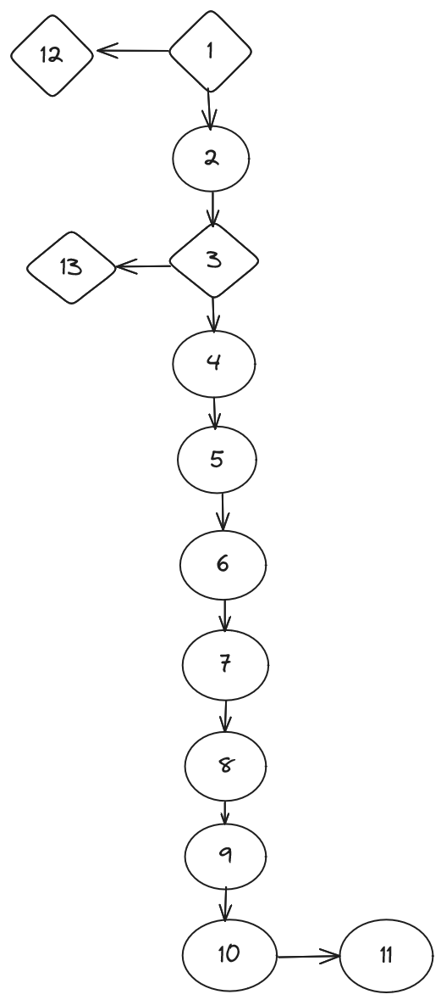

Florent VASSEUR--BERLIOUX, Tom BOGAERT, Assia GOUABI, Enzo GUIGNOLLE, Matthieu FARANDJIS 
INF2-A

# SAÉ S3 - Dossier de test
## Site dynamique Boite blanche

  
Ce document permet de s'assurer que les fonctions soient bien fonctionnelles comme souhaité.

       

## Plan
- ### [I - Introduction](#I)
- ### [II - Description de la procédure de test](#II)
- ### [III - Contexte des tests](#III)
- ### [IV - Test ](#IV)
    - #### [Test fonctions](#a)
        - #### [connectUser](#1a)
        - #### [valideMDP](#2a)
        - #### [executeSQL](#3a)
        - #### [recupererRoleDe](#4a)
        - #### [tablegenerate](#5a)
        - #### [pageAccess](#6a)
        - #### [valideEmail](#7a)
        - #### [deconnexionSite](#8a)
        - #### [affichageMenuDuHaut](#9a)
        - #### [operationCAPTCHA](#10a)
        - #### [verifyCAPTCHA](#11a)
        - #### [saveToSessionSignUp](#12a)

   

----------

   

## I - Introduction

Le document suivant à pour but de tester les différentes fonctions crées pour permettre une utilisation et compréhension plus simple des lignes de code.
 

## II - Description de la procédure de test

Les fonctions que nous allons tester seront connectUser, valideMDP et executeSQL, recupererRoleDe, tableGenerate, ValideEmail, operationCAPTCHA, verifyCAPTCHA, pageAccess, deconnexionSite, affichageMenuDuHaut, menuDeroulant.
 

## III - Contexte des tests

| Définition                         | Situation pour le test                                           |
|------------------------------------|------------------------------------------------------------------|
| Produit testé                      | Site dynamique (PHP)                                             |
| Configuration logicielle           | Firefox (118.0.1 et 64 bits) et Windows 10 (64 bits et 22H2) |
| Configuration matérielle           | Dell Optiplex 9020                                               |
| Date de début                      | 04/03/2024                                                       |
| Date de finalisation               |                                                                  |
| Test à appliquer                   | Vérification du bon fonctionnement des fonctions                 |
| Responsable de la campagne de test | Gouabi Assia                                                     |

   

----------

   

## IV - Test

### connectUser

Pour le schéma, dans l'instruction 4 nous avons regrouper toutes les instructions ensembles 

## Les chemins que nous proposons pour ce schéma 

### C1 = {1,7}  
### C2 = {1,2,3,6}  
### C3 = {1,2,3,4,5}

## Conception des tests boites blanches de la fonction ConnectUser

| Chemin | $loginMariaDB                                      | $loginSite | $mdpMariaDB | $connexionUtilisateur                                 | Résultat |
|--------|----------------------------------------------------|------------|-------------|-------------------------------------------------------|----------|
| C1     | l'utilisateur n'existe pas dans la base de données |            |             |                                                       | false    |
| C2     | l'utilisateur existe dans la base de données       | correct    | incorrect   | la connexion à la base de données n'a pas été établie | false    |
| C3     | l'utilisateur existe dans la base de données       |            |             | la connexion à la base de données a bien été établie  | true     |

## Réalisation des tests boites blanches de la fonction ConnectUser

| Chemin | $loginMariaDB | $loginSite | $mdpMariaDB | $connexionUtilisateur                                 | Résultat |
|--------|---------------|------------|-------------|-------------------------------------------------------|----------|
| C1     | 12222002      |            |             |                                                       | false    |
| C2     | 1             | alice      | azerty!     | la connexion à la base de données n'a pas été établie | false    |
| C3     | 1             | alice      | azerty!123  | la connexion à la base de données a bien été établie  | true     |

