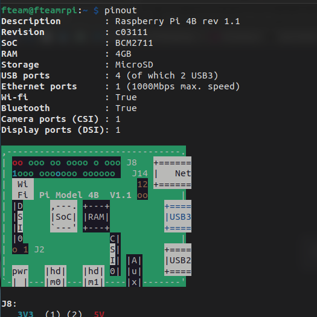

Florent VASSEUR--BERLIOUX, Tom BOGAERT, Assia GOUABI, Enzo GUIGNOLLE, Matthieu FARANDJIS<br>
INF2-A

<div align="center">


# SAÉ S3 - Installation du RPi4

<br><br>
Ce document décrit en détail le processus d'installation du RPi4, de son serveur LAMP, de sa mise en réseau, du ssh et de sa sécurisation.<br>
Les étapes décrites sont également appliquées au serveur de secours. Ce document aborde aussi la configuration du routeur.<br>
<br>
Rapport entièrement rédigé par Matthieu FARANDJIS.

</div>

<br><br><br><br><br><br><br>

---

## Plan

- ### [I – Présentation](#p1)
    - [**a) Présentation du RaspberryPi 4**](#p1a)
    - [**b) Présentation de RaspberryPi OS Lite**](#p1b)

- ### [II – Préparatif](#p2)
  - [**a) Matériels nécessaires**](#p2a)
  - [**b) Logiciels nécessaires**](#p2b)
  - [**c) Installation de RaspberryPi OS Lite**](#p2c)
  
- ### [III - Installation du serveur LAMP](#p3)
  - [**a) Premier démarrage de RaspberryPi OS Lite**](#p3a)
  - [**b) Installation d'Apache**](#p3b)
  - [**c) Installation de MariaDB**](#p3c)
  - [**d) Installation de PHP**](#p3d)
  - [**e) Installation de PHPMyAdmin**](#p3e)

- ### [IV - Mise en réseau via Hamachi](#p4)
  - [**a) Présentation de LogMeIn Hamachi**](#p4a)
  - [**b) Installation et utilisation**](#p4b)
    - [**i) Sur Windows**](#p4bi)
    - [**ii) Sur Linux**](#p4bii)
  - [**c) Problèmes rencontrés et hypothèses**](#p4c)
  - [**d) Résolution du problème**](#p4d)

- ### [V - Sécurisation](#p5)
  - [**a) Les utilisateurs, les groupes et leurs droits**](#p5a)
      - [i) Liste des utilisateurs et des groupes](#p5ai)
      - [ii) Droits des utilisateurs](#p5aii)
  - [**b) Limitation des intrusions**](#p5b)
    - [i) Présentation de Fail2Ban](#p5bi)
    - [ii) Installation de Fail2Ban](#p5bii)
  - [**c) Le pare-feu**](#p5c)
      - [i) Présentation de UFW](#p5ci)
      - [ii) Installation de UFW](#p5cii)
  - [**d) PHPMyAdmin**](#p5d)
      - [i) Limitation des connexions aux comptes](#p5di)
      - [ii) Changement de l'alias](#p5dii)


- ### [VI - Faire une sauvegarde du serveur](#p6)
  - [**a) Créer et restaurer une image**](#p6a)
  - [**b) Dossiers et fichiers à sauvegarder**](#p6b)

<br><br><br>

---

## <a name="p1"></a> I - Présentation

  - ### <a name="p1a"></a> a) Présentation du RaspberryPi 4
    Le RaspberryPi est un micro-ordinateur monocarte apparu en février 2012. Excepté l'alimentation et un support de stockage,
    nous y retrouvons tout le nécessaire pour le faire fonctionner comme un processeur et de la mémoire vive.<br>
    Comme pour la majorité des ordinateurs, celui-ci propose des ports pour y brancher un écran, des périphériques, une alimentation, une caméra ou encore un câble ethernet.<br>
    <br>
    Cependant, le RPi 4 comporte des différences avec les anciens modèles de RPi.<br>
    En termes de processeur, son CPU possède des cœurs plus récents (les Cortex-A72) et son GPU est 25% plus rapide que les précédents modèles :
    désormais sa résolution d'écran maximal est de la 4K UltraHD. Son port HDMI/Mini-HDMI a laissé place à deux ports micro HDMI.<br>
    Concernant la mémoire vive passant de LPDDR2 à LPDDR4 d'ailleurs, il y a quatre versions du RPi4 : une 1Go, une 2Go, 8Go et une à 4Go, la nôtre.<br>
    Deux de ses ports USB 2 ont laissé place à deux ports USB 3, et en termes de connectique réseau, le RPi4 possède un meilleur port LAN, un meilleur Wi-Fi et un meilleur Bluetooth.<br>
    <br>
    Nous pouvons en apprendre plus sur les caractéristiques de notre Raspberry Pi 4 en exécutant la commande Raspberry OS : `pinout`<br>
    <br>
    <div align="center">
    <br>
    <i>résultat de la commande pinout</i>
    </div>
    <br>
    <br>
    Comme précédemment dit, Le RPi 4 possède un processeur ARM Cortex-A72. Même si c'est un processeur 64bits, c'est un processeur faisant partie de la famille ARMv8 et non des x86 comme on le retrouve souvent sur nos PC.<br>
    Les processeurs ARM sont principalement utilisé pour "les appareils compacts et tendent à optimiser l'autonomie, la taille, le refroidissement et surtout, les coûts" selon RedHat. Ce qui correspond aux critères du RPi 4 : être un micro-ordinateur abordable<br>
    On remarque cependant que selon RedHat, l'architecture x86 est plutôt utilisé pour les serveurs pour leur vitesse. Ainsi, en dehors du cadre de cette SAÉ, utiliser RaspberryPi comme serveur n'est pas le mieux.<br>
    <br>
    On remarque aussi le préfixe "LP" de "LPDDR4" comme type de mémoire vive du RPi4. "LP" pour "Low Power" est une version plus petite et moins consommatrice en termes de ressources que le simple DDR "Double Data Rate".<br>
    La DDR a remplacé la SDRAM au début des années 2000 par sa rapidité : "La DDR transfère les données au processeur à la fois dans la phase montante et descendante des signaux d’horloge" selon Crucial.<br>
    Encore une fois, c'est un composant adapté pour les appareils compacts comme le RaspberryPi.<br>
    
    <br><br>
    **Sources :**
    - https://www.jmdoudoux.fr/raspberry/raspberry_pi_4_modele_B.htm
    - https://www.conrad.fr/fr/guides/materiel-educatif-kits-de-developpement/raspberry-pi.html
    - https://fr.wikipedia.org/wiki/Raspberry_Pi
    - https://www.raspberrypi.com/products/raspberry-pi-4-model-b/
    - https://fr.wikipedia.org/wiki/ARM_Cortex-A72
    - https://www.redhat.com/fr/topics/linux/ARM-vs-x86
    - https://www.hardware.fr/news/13047/quelques-details-lpddr4-ddr4-wide-i-o.html
    - https://fr.msi.com/blog/ultra-thin-business-and-productivity-laptop-with-lpddr4x-memory
    - https://www.crucial.fr/articles/about-memory/difference-among-ddr2-ddr3-ddr4-and-ddr5-memory
    - https://fr.wikipedia.org/wiki/LPDDR


  - ### <a name="p1b"></a> b) Présentation de RaspberryPi OS Lite

    RaspberryPi OS Lite est la version de RaspberryPi OS sans interface graphique.<br>
    Cette version permet de démarrer le RPi4 sans écran, sans clavier et sans souris. Elle pèse près de 600 Mo, c'est donc le système idéal pour notre serveur.<br>
    Bien que nous savons utiliser le terminal, le cas échéant, il est toujours possible d'ajouter une interface graphique à Raspberry OS Lite.<br>
    <br>
    RaspberryPi OS est fondé sur le système d'exploitation gratuit Debian et est conçu spécialement pour le RaspberryPi.<br>
    En effet, au lancement de Raspbian, l'ancien nom de l'OS, Debian n'était pas disponible pour la famille de processeur du RaspberryPi : l'ARMv6.<br>
    Vu que ce système d'exploitation est dédié au RaspberryPi, il comporte des commandes dédiées au micro-ordinateur comme "raspi-config" ou encore "pinout" cité plus tôt.<br>
    Ubuntu étant aussi issu sur Debian, nous pouvons aussi bien s'aider de la documentation de Raspberry OS, que celle de Debian ou celle d'Ubuntu.<br>
    Pour notre serveur de secours, nous utiliserons Ubuntu Server. L'installation du serveur LAMP et de LogMeIn Hamachi reste pratiquement la même.<br>

    <br><br>
    **Sources :**
    - https://www.raspberrypi.com/documentation/
    - https://raspberrytips.fr/raspberry-pi-os-versions/
    - https://alain-michel.canoprof.fr/eleve/tutoriels/raspberry/premiers-pas-raspberrypi/activities/utiliser-raspi-config.html
    - https://www.macg.co/ailleurs/2023/10/les-raspberry-pi-passent-bookworm-pour-le-nouvel-os-139771

<br><br><br>

---

## <a name="p2"></a> II - Préparatif

  - ### <a name="p2a"></a> a) Matériels nécessaires
    Pour utiliser le RPi4 sur le même écran de son ordinateur tout en l'utilisant, on peut utiliser un boîtier d'acquisition.<br>
    C'est un adaptateur HDMI vers USB, permettant de récupérer le signal vidéo sur son ordinateur. Utile pour enregistrer l'écran du RPi4 par exemple.<br>

    <br>
    Pour procéder à l'installation du système, il faut au préalable avoir :<br><br>

    - **Un RaspberryPi et son alimentation**<br>
      Monsieur Hoguin nous a confié un RaspberryPi 4 modèle B. C'est un micro-ordinateur à manipuler avec précaution. En effet, il n'est pas dans un boîtier.<br>
      Son alimentation se branche au RPi4 via son port USB type C.<br><br>
    
    - **Une carte microSD**<br>
      Monsieur Hoguin nous a donné une carte micro SD Verbatim de 16Go.<br>
      Le RPi4 est réputé comme étant un tueur de carte micro SD. Nous devons donc archiver régulièrement l'intégralité du contenu de cette carte.<br><br>
    
    - **Un câble HDMI et son adaptateur vers micro HDMI**<br>
      Le RPi4 se branche en micro HDMI. Ayant un câble HDMI, un adaptateur était nécessaire. Il nous a coûté 3€ à la FNAC.<br><br>
  
    - **Un clavier d'ordinateur**<br>
      Un clavier d'ordinateur basique se branchant en USB suffit.<br><br>
    
    - **Un câble ethernet** (préférable)<br>
      Brancher un câble ethernet permet de vérifier grâce aux leds que le RPi4 soit bien connecté au réseau.<br>
      On peut aussi connecter le RPi4 en Wi-Fi. Mais grâce au câble nous sommes assurés de ne pas accuser la connexion si on rencontre des problèmes dans la plupart des cas.

<br>

  - ### <a name="p2b"></a> b) Logiciels nécessaires

    Pour installer un système sur un support dédié au RaspberryPi, le plus simple est d'utiliser le logiciel "Pi Imager".<br>

    <br>
    En-dehors du logiciel Pi Imager, vu que nous possédons un boîtier d'acquisition, nous allons utiliser les logiciels VLC et Mirillis Action!.<br>
    VLC permettra d'afficher sur son ordinateur la sortie vidéo du boîtier provenant du RPi4, et Action! permettra en même temps d'enregistrer celui-ci et même le bureau Windows.<br>
    Grâce aux vidéos, nous pouvons décrire précisément l'installation du système et la résolution des problèmes rencontrés.<br>
    Des captures d'écran de ces vidéos illustrent ce document.<br>

    <br><br>

    <div align="center">
       <br>
       <i>VLC affichant l'écran du RPi4 sur Windows 10</i>
    </div>


- ### <a name="p2c"></a> c) Installation de Raspberry OS Lite

    À partir du bouton "Choisir l'OS", Pi Imager propose différents systèmes pouvant être installé. On peut aussi installer son propre système.<br>
    Nous avons choisi Raspberry OS Lite pour les raisons évoqué lors de la présentation de ce système.

    <br><br>

    <div align="center">
        <br>
        <i>Menu de Pi Imager</i>
    </div>
  
    <br>

    Une fois avoir sélectionné le système, un petit bouton engrenage apparaît pour paramétrer l'installation de RaspberryPi OS Lite.<br>
    On peut y donner un nom à l'ordinateur, activer SSH, modifier le login et le mot de passe de l'utilisateur par défaut, configurer le Wi-Fi, le clavier ou encore le fuseau horaire.<br>
    Nous avons configuré l'installation par rapport à notre besoin. Il est tout à fait possible de le faire plus tard avec la commande `raspi-config`.<br>
    <br>
    Les trois cases à cocher tout en bas ne sont pas très importante.<br>
    La télémétrie correspond à l'envoi de pings à raspberry.org pour des fins de statiques, c'est inutile, ça ne restreint pas l'utilisation du système, nous l'avons donc désactivé pour ne pas être surveillés.<br>
    <br><br>

    <div align="center">
        <br>
        <i>Options d'installation de Pi Imager</i>
    </div>

    <br>

    Une fois fait, il suffit de sélectionner le bon lecteur et de flasher la carte microSD. C'est assez rapide, et la carte microSD est immédiatement opérationnel.

    <br><br>
    **Source :**
    - https://framboise-pi.skyost.eu/article/maitriser-raspberry-pi-imager/

<br><br><br>

---

## <a name="p3"></a> III - Installation du serveur LAMP

La vidéo d'installation du serveur est disponible ici : https://www.youtube.com/watch?v=CV8lqGxK16w <br>
Interdiction de la partager à quiconque en dehors de la FTEAM ou de nos professeurs (comporte des informations sensibles sur le projet).<br> 

- ### <a name="p3b"></a> a) Premier démarrage de RaspberryPi OS Lite
    Il n'y a rien de particulier qui se passe durant le premier démarrage. 
    Il nous demande notre login et le mot de passe que nous avons précisé sur Pi Imager et on a directement accès à RaspberryPi OS Lite.<br>
    Le cas échéant, l'utilisateur par défaut est "pi" et son mot de passe est "password".<br>
    <br>
    En revanche, attention !<br>
    Vu que nous avons activé SSH via Pi Imager, celui-ci est déjà activé. Cela peut poser des soucis de sécurité notamment si on a laissé l'utilisateur par défaut !

- ### <a name="p3b"></a> b) Installation d'Apache

    Apache est un serveur web open-source HTTP et multi-plateforme populaire apparu en 1995. En 2004, il atteint un pic de 69% de parts du marché.
    Il est activement maintenu par l’Apache Software Foundation, sa dernière version, la 2.4.58 est sorti le 19 octobre 2023.<br>
    <br>
    Nous n'avons pas rencontré de difficulté pour son installation, il suffit seulement d'exécuter la commande : sudo apt install apache2<br>
    <br>
    **Pour rappel :**<br>
    SUDO permet de s'octroyer le temps de cette commande les droits root.<br>
    APT pour "Advanced Packaging Tool" est, selon la documentation d'Ubuntu, un système complet et avancé de gestion de paquets permettant la recherche, l'installation et la désinstallation facile de logiciels et utilitaires.<br>
    APACHE2 est le serveur que nous allons utiliser. Sur RedHat, son nom est HTTPD.<br>
    <br>
    <br>
    Une fois installé, Apache2 est directement exécuté. Nous pouvons voir son statut en exécutant la commande : `systemctl status apache2`.<br>
    **Pour le démarrer, on doit utiliser la commande :** `systemctl start apache2`<br>
    **Pour le redémarrer :** `systemctl restart apache2`<br>
    **Pour l'arrêter :** `systemctl stop apache2`<br>
    **Pour le démarrer au prochain démarrage :** `systemctl enable apache2` (par défaut)<br>
    **Pour l'empêcher de démarrer au prochain démarrage :** `systemctl disable apache2`<br>
    <br>
    <div align="center">
        <br>
        <i>Statut d'Apache</i>
    </div>
    <br>
    Étant donné que nous utilisons un système d'exploitation sans interface graphique, nous ne pouvons pas vérifier visuellement que la page par défaut d'Apache apparaît correctement.<br>
    Pour cela, il suffit d'utiliser un autre ordinateur du réseau local et de taper l'adresse IP local du RaspberryPi 4. Nous pouvons la connaître via la commande `ifconfig` en installant au préalable le paquet net-tools<br>
    En faisant cela, nous obtenons la page par défaut d'Apache index.html pour serveur Debian.<br>
    <br>
    <div align="center">
        <br>
        <i>index.html généré par Apache</i>
    </div>
    <br>

    Le répertoire par défaut du site est sous Linux : `/var/www/html`.<br>
    Il est recommandé de le laisser configurer ainsi afin d'éviter qu'un utilisateur puisse accéder à tout le disque du serveur.<br>

    <br>
    Attention !<br>
    Il est possible qu'au prochain démarrage du routeur, celui-ci change l'adresse IP local assigné au RPi4.<br>
    Il est possible d'assigner une adresse IP local statique au RPi4 en se connectant en tant qu'administrateur à celle-ci. La manipulation dépend du routeur.<br>
    <br>
    Remarque :<br>
    Si la page index.html n'arrive pas à être chargé (chargement infini) mais que le fichier existe bien, vérifiez si le pare-feu de votre routeur ainsi que celui de RaspberryPi OS Lite autorise l'utilisation du port 80.<br>
    Par défaut, RaspberryPi OS ne possède pas de pare-feu. Il est possible que le problème vienne d'ailleurs sinon.<br>

    <br><br>
    **Sources :**
  - https://fr.wikipedia.org/wiki/Apache_HTTP_Server
  - https://doc.ubuntu-fr.org/apache2
  - https://doc.ubuntu-fr.org/apt
  - Rapport de la SAÉ 2.03 par Matthieu FARANDJIS et Tom BOGAERT

- ### <a name="p3c"></a> c) Installation de MariaDB
    MariaDB est un système de gestion de bases de données relationnelle open source qui est largement utilisée en tant qu'alternative à MySQL.<br>
    Il a été créé par les développeurs d'origine de MySQL après l'acquisition de MySQL par Oracle Corporation.<br>
    MariaDB est conçu pour être un remplacement direct de MySQL, en offrant une compatibilité élevée avec les applications et les outils existants utilisant MySQL.<br>
    <br>
    **Pour l’installation de MariaDB on utilise la commande :** `sudo apt install mariadb-server`<br>
    <br>
    Tout comme Apache2, MariaDB-server est un service, nous pouvons utiliser systemctl dessus. Par défaut, une fois installé, il démarre et il redémarre à chaque démarrage de RPi OS sauf si on lui interdit.<br>
    <br>

    <div align="center">
        <br>
        <i>MariaDB exécutant la commande SHOW DATABASES;</i>
    </div>

    <br>
    Site intéressant installation/sécurisation/répertoires/... : https://doc.fedora-fr.org/wiki/Installation_et_configuration_de_MariaDB
    <br>

    <br><br>
    **Source :**
  - Rapport de la SAÉ 2.03 par Matthieu FARANDJIS et Tom BOGAERT

- ### <a name="p3d"></a> d) Installation de PHP
    PHP (Hypertext Preprocessor) est un langage open source de script côté serveur très populaire et largement utilisés pour le développement web, apparu en 1995.<br>
    Il est utilisé pour la création de pages web dynamique et interactif.<br>
    Son site de référence où l'on peut trouver toute sa documentation est http://www.php.net.<br>
    <br>
    Pour installer PHP et son module permettant l'utilisation de MariaDB, il suffit de faire la commande `sudo apt install php php-mysql`.<br>
    <br>
    Nous pouvons vérifier son activité avec la commande `systemctl`, mais pour vérifier qu'il fonctionne, nous pouvons créer une page `info.php`: 
    ```php
    <?php
    phpinfo();
    ?>
    ```
    Si PHP est opérationnel, nous pourrons voir les informations liés à notre installation de PHP.<br>
    <br>

    <div align="center">
        <br>
        <i>info.php affichant phpinfo()</i>
    </div>

    <br>
    Pour cette SAÉ, nous allons utiliser la version 8.2 de PHP.

  <br><br>
  **Sources :**
  - https://doc.ubuntu-fr.org/php
  - Rapport de la SAÉ 2.03 par Matthieu FARANDJIS et Tom BOGAERT

- ### <a name="p3e"></a> e) Installation de PHPMyAdmin
    D'après la page de présentation de PHPMyAdmin par Ubuntu : "phpMyAdmin est une interface web en PHP pour administrer à distance les SGBD MySQL et MariaDB".<br>
    <br>
    Installer PHPMyAdmin : `sudo apt install phpmyadmin`<br>
    <br>
    Durant l'installation, nous aurons une interface graphique sur terminale pour configurer PHPMyAdmin.<br>
    Nous pouvons suivre le guide d'installation de la documentation d'Ubuntu à la différence qu'il ne proposera pas de créer un profil administrateur.<br>
    <br>
    Une fois installée, nous pouvons constater que l'onglet http://192.168.1.10/phpmyadmin (192.168.1.10 est l'IP local) est inaccessible (erreur 404).<br>
    La raison est qu'Apache ne détecte pas PHPMyadmin.<br>
    <br>
    Pour résoudre ce problème, il suffit d'ajouter dans le fichier de configuration d'apache (/etc/apache2/apache2.conf) la ligne : `Include /etc/phpmyadmin/apache.conf`<br>
    <br>
    Nous pouvons alors accéder à cette page et nous connecter au compte PHPMyAdmin avec le mot de passe créé plus tôt.<br>
    <br>
    En réalité, PHPMyAdmin est un utilisateur MariaDB. Pour créer un administrateur, nous devons créer un utilisateur admin MariaDB.<br>
    Pour créer un tel utilisateur, nous pouvons suivre le tutoriel d'Ubuntu sur la page de présentation de PHPMyAdmin en exécutant la commande `sudo mariadb` puis dans l'ordre :

    ```sql
    CREATE USER 'nom_utilisateur_choisi'@'localhost' IDENTIFIED BY 'mot_de_passe_solide';
    GRANT ALL ON *.* TO 'nom_utilisateur_choisi'@'localhost' WITH GRANT OPTION;
    FLUSH PRIVILEGES;
    QUIT;
    ```
    Note : FLUSH PRIVILEGES permet d'indiquer qu'il faut recharger les privilèges des tables de droits dans la base de données système de MySQL.

    <br>

    <div align="center">
        <br>
        <i>PHPMyAdmin affichant des informations sur le serveur et sa base de données</i>
    </div>

  <br><br>
  **Sources :**
  - https://www.gladir.com/CODER/MYSQL/flush.htm (requête sql flush)
  - https://doc.ubuntu-fr.org/phpmyadmin (installation et utilisateur admin)
  - https://help.ubuntu.com/community/ApacheMySQLPHP (pour l'Include)

<br><br><br>

---

## <a name="p4"></a> IV - Mise en réseau via Hamachi

- ### <a name="p4a"></a> a) Présentation de LogMeIn Hamachi
    Hamachi de LogMeIn (aujourd'hui Goto) est un logiciel pair à pair permettant de connecter plusieurs ordinateurs distants dans un réseau local virtuel chiffré en AES 256 bits.<br>
    Simple d'utilisation, un utilisateur peut ouvrir un réseau local gratuitement où les autres membres n'auront qu'à le rejoindre avec un identifiant et un mot de passe.<br>
    Il évite de faire des configurations réseaux de son routeur et de son ordinateur, ce qui peut être rassurant si on a peur de faire une mauvaise manipulation pouvant compromettre la sécurité de notre vrai réseau.<br>
    <br>
    Cependant, LogMeIn Hamachi possède 4 principaux défauts :
  - Un réseau gratuit est limité à au maximum 5 personnes (dont le propriétaire de celui-ci).
  - Hamachi demande la création d'un compte Goto (LogMeIn) pour être utilisé. Cependant, il accepte les adresses emails temporaires comme https://temp-mail.org/fr/.
  - Le logiciel démarre automatiquement au démarrage du système, il faut configurer Windows/Linux pour l'en empêcher.
  - Si on oublie de se déconnecter via le bouton on/off, l'ordinateur reste connecté en réseau local aux autres machines, même avec un redémarrage.
  
    <br>

  Si Hamachi permet d'éviter de mettre son réseau directement accessible sur internet, il peut toutefois représenter un risque de sécurité si ont oubli de se déconnecter.<br>
    **Si un membre oubli de se déconnecter, il faut le prévenir**<br>
    <br>
    Une alternative préférée est Radmin (https://www.radmin-vpn.com/), logiciel mieux que Hamachi et offrant plus de possibilité que celui-ci.<br>
    Malheureusement, il n'existe pas sous Linux. Nous ne pouvons donc pas l'utiliser.<br>
    <br>
    <div align="center">
        
        <br>
        <i>A gauche : Hamachi sur Windows</i><br>
        <i>A droite : Hamachi sur Linux</i>
    </div>
    <br>
    Nous allons utiliser Hamachi pour pouvoir mettre en réseau le serveur RaspberryPi mais également le serveur de secours.
    Ainsi, sans même être installé à l'IUT, chaque membre pourra l'utiliser de chez lui et nous pourrons travailler sur les mêmes fichiers et la même base de données.<br>
    Grâce à la mise en réseau, nous pourrons même tous ensemble configurer le serveur à l'IUT sans devoir l'emporter, via Hamachi sur nos ordinateurs portables personnel.<br>
    Un autre avantage d'Hamachi est que la mise en réseau à l'IUT n'est plus une urgence, au contraire, cela nous permet facilement de faire des copies image de la carte microSD<br>
    <br>
    En cas de panne du serveur RPi4, le serveur de secours sera déjà prêt à l'emploi le temps que la situation redevienne normale.

    <br><br>
    **Sources :**
  - https://fr.wikipedia.org/wiki/LogMeIn_Hamachi
  - https://www.vpn.net/ (site officiel de LogMeIn Hamachi)
  - https://www.gadgeek.fr/logmein-hamachi/

- ### <a name="p4b"></a> b) Installation et utilisation
  - #### <a name="p4bi"></a> i) Sur Windows

      L'installation d'Hamachi est rapide et simple à faire :<br>
    - Sur https://vpn.net/, cliquez sur "Download Now" pour télécharger l'installateur.<br><br>
    - Démarrez LogMeIn Hamachi, celui vous demande de créer un compte. Vous pouvez utiliser une adresse email temporaire comme https://temp-mail.org/fr/. <br><br>
    - Créer un réseau
      - Bouton réseau > cliquez sur créer un réseau.
      - Renseignez un identifiant de réseau et son mot de passe.
      - Partager l'identifiant et le mot de passe aux utilisateurs à inviter.<br><br>
    - Rejoindre un réseau
      - Bouton réseau > cliquez sur rejoindre un réseau.
      - Renseignez l'identifiant et le mot de passe partagé par le propriétaire du réseau.
      - Votre ordinateur apparaît dans la liste.<br><br>
    - Hamachi est opérationnel !

    <br>

    **Pour se connecter/déconnecter de Hamachi :** cliquez sur le grand bouton on/off<br>
    **Récupérer son IP Hamachi :** clic sur l'IP à côté du bouton on/off<br>
    **Récupérer l'IP d'un hôte :** clic droit sur l'hôte, copier l'adresse (IPv4 par ex)<br>
    **Changer son pseudo :** Système > Préférence > modifier (ligne du nom)
    <br>
   - #### <a name="p4bii"></a> ii) Sur Linux
  
     - Installer lsb et lsb-core :<br>
       1) Mettre à jour les paquets : `sudo apt-get update`<br>
       2) Installer lsb et lsb-core : `sudo apt-get install lsb lsb-core`<br>
       Remarque : Sur RPi4 du moins, cela fonctionne sans (impossible de les installer)
       <br>

     - Télécharger l'installeur :
       - Avec interface graphique : https://vpn.net/linux et télécharger le fichier<br>
         Pour Debian (Ubuntu compris) avec un processeur de type AMD64 (le plus courant) : `logmein-hamachi_2.1.0.203-1_amd64.deb`<br>
         Pour Debian (RaspberryPi OS compris) avec un processeur de type ARMHF (RPi4 donc) : `logmein-hamachi_2.1.0.203-1_armhf.deb`<br>
         <br>
         Remarque, HF de "ARMHF" signifie Hard Float.<br>
         C'est compatible avec les processeurs ARM à partir de ARMv7, cela fonctionne donc avec le RaspberryPi 4<br>
         Cette version semble être la plus appropriée pour notre micro-ordinateur.<br>
       - Sans interface graphique :
         Faire : `sudo wget https://www.vpn.net/installers/fichierInstallateur.qqc` <br>
         Pour notre RPi4 en conséquence : `sudo wget https://www.vpn.net/installers/logmein-hamachi_2.1.0.203-1_armhf.deb` <br>
       <br>
     - Installer Hamachi :
       - Avec interface graphique (Debian) :
         (sur Ubuntu du moins) : Clic droit > Ouvrir avec une autre application > Installation de l'application (cliquez sur Sélectionner) > Installer<br>
         <br>
       - Sans interface graphique (Debian) :
         Faire `sudo dpkg -i logmein-hamachi_2.1.0.203-1_armhf.deb`<br>
         Note : `dpkg` est le gestionnaire de paquet Debian. L'option `-i` signifie installer le paquet<br>
       <br>
     
     **Se connecter/déconnecter :** `sudo hamachi login`, `sudo hamachi logoff`<br>
     **Changer son pseudo Hamachi :** `sudo hamachi set-nick [nouveauPseudo]`<br>
     **Se connecter à son compte Goto (LogMeIn) :** `sudo hamachi attach [emailDeSonCompteGoto]`<br>
     **Créer un réseau :** `sudo hamachi create [IDENTIFIANT_NOUVEAU_RESEAU] [MDP_NOUVEAU_RESEAU]`<br>
     **Rejoindre un réseau :** `sudo hamachi join [IDENTIFIANT_RESEAU] [MDP_RESEAU]`<br>
     **Page d'aide :** `sudo hamachi help`<br>
     **Liste des serveurs et de leurs membres :** `sudo hamachi list`<br>
     **Informations sur votre installation de Hamachi :** `sudo hamachi`<br>
     <br>
     **Arrêter Hamachi :** `sudo systemctl stop logmein-hamachi`<br>
     **L'empêcher de démarrer automatiquement au démarrage :** `sudo systemctl disable logmein-hamachi`<br>
     Les autres commandes systemctl fonctionnent (comme start, restart, ou encore enable).<br>

   <br><br>
   **Sources :**
  - https://medium.com/@KyleARector/logmein-hamachi-on-raspberry-pi-ad2ba3619f3a
  - https://stackoverflow.com/questions/37790029/what-is-difference-between-arm64-and-armhf (signification de ARMHF. Note : commentaire d'un utilisateur semblant fiable)
  - https://www.clubic.com/article-283362-1-tuto-hamachi-test-hamachi-clubic.html
  - https://www.gadgeek.fr/logmein-hamachi/
  
    

- ### <a name="p4c"></a> c) Problèmes rencontrés et hypothèses

    Nous avons rencontré un problème un peu étrange sous sa forme.<br>
    Lorsque nous accédions au serveur Apache du RPi4 via le réseau local réel, nous pouvions naviguer sans aucun souci entre les différentes pages.
    Mais lorsque l'ordinateur accède au RPi4 depuis un autre réseau (réseau 4G par exemple), l'ordinateur recevait bien les erreurs 403 et 404, mais le navigateur n'arrivait pas à charger les pages.<br>
    <br>
    En premier lieu, nous avons soupçonné Apache de bloquer la connexion via Hamachi, nous avons alors vérifié les fichiers de configurations et chercher de l'aide sur internet.<br>
    L'une des raisons évoqué d'un mauvais chargement des pages Apache, était le pare-feu du système. C'était d'ailleurs ce problème que nous avions rencontré durant la SAÉ du S2 lorsque nous avons cherché à modifier le répertoire d'Apache.<br>
    Nous avons découvert qu'il n'y en avait pas de fonctionnel. Les plus populaires : Netfilter, UFW et IPtables n'étaient pas installé. AppArmor de son côté n'a pas pu être démarré au démarrage, et SELinux, le pare-feu qui nous avait posé problème, était propre à CentOS.<br>
    Malgré une tentative d'installation et de configuration, le résultat était le même.<br>
    En approfondissant nos recherches, on a entendu qu'il existait un petit pare-feu dans le noyau de Linux. Nous avons écarté cette possibilité de source du problème.<br>
    <br>
    Nous sommes alors revenu sur Apache, persuadé que le problème venait d'Apache. Peut-être que le serveur n'autorisait que les IP local de type 192.168 ?<br>
    Aucun site n'en faisait référence lors d'une mise à disposition du serveur directement via internet. Il y avait bien des autorisations pour le réseau local, mais même en les ajustant, le résultat était le même.<br>
    Pire encore, dans les journaux d'accès au serveur, Apache indiquait un code web 200, donc qu'il n'y avait aucun problème.<br>
    <br>
    En changeant le port d'écoute d'Apache, et en le relançant, on remarquait que la page par défaut index.html d'Apache était bien accessible pendant un temps très court.<br>
    Ce moment était juste après le changement du port d'écoute, ou vers la fin du démarrage de RaspberryPi OS.<br>
    Nous avons donc pu remarquer que le problème ne venait définitivement pas d'Apache.<br>
    D'autant plus qu'en utilisant Hamachi via la connexion ethernet raccordé au routeur, cela fonctionnait normalement.<br>
    Ça pouvait difficilement être un fichier de configuration, sinon jamais il y aurait eu la possibilité de charger malgré tout cette page.<br>
    Ça aurait pu être un pare-feu qui aurait bloqué l'IP à la détection d'une connexion après coup, sauf qu'il n'y a pas de pare-feu, puis on s'était dit qu'elle aurait été bloqué dès le départ.<br>
    <br>
    Nous avons alors tenté SSH, le résultat était le même qu'avec Apache.<br>
    <br>
    Nous avons ainsi soupçonné la connexion. Nous avons remarqué que nous pouvions faire un ping au serveur, mais celui-ci n'en était pas capable lorsque nous passions par Hamachi.<br>
    Peut-être que c'était un problème de table de routage. Peut-être la box internet renvoyait systématique sur le port ethernet de mon ordinateur les paquets du serveur.<br>
    N'arrivant pas à accéder à la box internet en tant qu'administrateur, nous avons tenté de la relancer en déconnectant l'ordinateur et en faisant d'autres manipulations de branchement, mais le résultat était le même.<br>
    <br>
    Juste avant de finir de trouver la solution, nous avons remarqué que l'accès au serveur n'était pas totalement bloqué.<br>
    Il était possible d'accéder à certaines pages du site si elle était strictement inférieur à 2,8ko. Aucune image n'arrivait à être charger, peu importe sa taille.<br>
    Concernant SSH et SFTP, le résultat était similaire qu'avec Apache.<br>
    Pour SFTP via l'utilisateur administrateur, il n'y avait aucun problème tant qu'on était sur le réseau local réel.<br>
    Si nous utilisions Hamachi via une autre connexion, FileZilla arrivait à lire certains répertoires et les manipulés.<br>
    On pouvait envoyer des documents de toute taille, mais il était impossible de les télécharger.<br>
    <br>
    <br>
    Nous n'arrivions pas à discerner la source du problème. D'autant plus que le problème était exactement le même en installant le serveur de secours avec Ubuntu Server.<br>
    Cependant, ça semblait mieux fonctionner lorsque le serveur était hébergé sur Ubuntu Desktop ou Windows lors de nos essais entre Matthieu et Florent.<br>
    C'était un véritable casse-tête où il semblait n'y avoir aucune solution au problème.<br>

- ### <a name="p4d"></a> d) Résolution du problème

    La seule chose que nous ne soupçonnions pas vraiment, c'était le routeur.<br>
    Déjà car, moi Matthieu, ne pouvait plus administrer ma box internet vu que nous avions perdu le mot de passe administrateur depuis le temps. Donc j'espérais que cela ne venait pas de là.<br>
    <br>
    Mais surtout que ce n'était pas la première fois que j'utilisais Hamachi, et qu'avec la même configuration réseau, le logiciel était entièrement utilisable pour jouer à des jeux.<br>
    Vu que la connexion à Apache, SSH, ou encore SFTP passait par Hamachi, il ne devait y avoir aucun problème du point de vu du routeur, vu que le logiciel fonctionnait pour d'autres utilisations.<br>
    Pareil pour SSH par exemple, ma box internet ne m'a jamais bloqué lorsque je me connectais à distance sur le réseau de l'IUT : le serveur Titan pouvait me transmettre des fichiers et je pouvais en transmettre.<br>
    <br>
    La seule source de problème de connection aurait été Hamachi limitant la connexion, si ce n'est ni les serveurs, ni mon ordinateur, ni la box internet.<br>
    Sauf que je n'ai rien trouvé affirmant une limitation des connexions par Hamachi que ce soit sur des forums ou de la documentation proposée par LogMeIn.<br>
    <br>
    <br>
    Étonnamment, c'était le pare-feu du routeur qui limitait la connexion par Hamachi, je n'ai pas trouvé la raison de ce problème.<br>
    <br>
    **Pour résoudre ce problème, il faut autoriser les connexions avec les ports TCP 12975, TCP 32976 et UDP 17771 du routeur**<br>

    <br>
    <div align="center">
        <br>
        <i>Pare-feu personnalisable de la Livebox 2</i>
    </div>


## <a name="p5"></a> V - Sécurisation
Si avoir un beau projet correspondant aux attentes du client est notre objectif premier, la sécurisation du système informatique n'est pas à négliger.<br>
Rien que depuis le moteur de recherche Google, nous pouvons accéder à des moteurs de recherches d'appareils connectés. Beaucoup de ces appareils sont peu sécurisé si ce n'est pas du tout.<br>
Il existe des robots spécialisés dans le piratage d'appareils connectés. Certains cherchent à craquer les mots de passe SSH, d'autres à craquer les mots de passe PHPMyAdmin.<br>
<br>
Notre système informatique est conçus pour être utilisé sur le réseau local de l'IUT, mais cela n'épargne pas pour autant le risque de piratage.<br>
Si le risque d'intrusion dans ce réseau par un ordinateur distant est peu probable, le piratage par l'un de nos camarades est en revanche très probable.<br>
<br><br>
Ainsi, cette partie explique comment nous avons sécurisé notre RaspberryPi.<br>
Pour rappel, le RaspberryPi ne possède pas de système de sécurité outre celui du noyaux Linux.<br>
<br><br>
Notre travail se fonde sur https://raspberrytips.fr/securiser-raspberry-pi/?utm_content=cmp-true <br>

- ### <a name="p5a"></a> a) Les utilisateurs, les groupes et leurs droits
    - #### <a name="p5ai"></a> i) Liste des utilisateurs et des groupes
        Plutôt que d'utiliser une seule session pour tout le monde, nous avons préféré créer une session pour chacun d'entre nous et une pour notre client.<br>
        Nous avons rassemblé nos sessions dans un groupe "FTEAM" et la session de notre client dans un groupe "PROF".<br>
        <br>
        Cela nous permet de limiter le risque de fuite des identifiants de la session sudoer vu que nous l'utiliserons uniquement pour la configuration du sytème.<br>
        Nos sessions permettent uniquement de modifier le répertoire /var/www/html où est situé le site. Avec la session sudoes, il est possible de limiter davantage les accès.<br>
        En cas de piratage, nous pouvons neutraliser le mot de passe la session infecté tout en étant assurer que le pirate a été limité dans ses actions.<br>
        Notre client à sa propre session sudoer.<br>
        <br><br>
        **Remarque :**<br>
        Une session "sudoer" est une session capable d'utiliser la commande `sudo`. Cette commande permet d'user les droits administrateurs pour exécuter une commande.<br>
        La commande sudo est très dangereuse ! Elle permet d'avoir un contrôle total de la machine, il est donc possible de détruire toute la protection du serveur avec !<br>
        <br>
        **Créer un utilisateur et lui affecter un groupe :** `sudo useradd [UTILISATEUR] -G [GROUPE]`<br>
        L'option -G précise le groupe à attribuer.<br>
        **Créer un groupe :** `sudo groupdel [GROUPE]`<br>
        **Supprimer un groupe :** `sudo groupadd [GROUPE]`<br>
        **Définir le groupe principal d'un utilisateur :** `sudo usermod --gid [GROUPE] [UTILISATEUR]`<br>
        **Afficher les groupes :** `getent group`<br>
        **Afficher les membres d'un groupe :** `getent group [GROUPE]`<br>
        **Afficher les utilisateurs :** `cut -d: -f1 /etc/passwd`<br>
        **Changer le mot de passe d'un utilisateur :** `passwd [UTILISATEUR]`<br>
        <br>
    - #### <a name="p5aii"></a> ii) Droits des utilisateurs
       <br> 
Nous avons créé des utilisateurs affectés à chaque membre du groupe de travail. Ces utilisateurs appartiennent au groupe fteam. 
<br>
Par la suite, nous avons accordé les droits administratifs de lecture, d'écriture et d’exécution aux membres de ce groupe. Pendant que les membres du groupe pourront écrire et lire l’ensemble des fichiers du répertoire /var/www/html, les autres pourront simplement les visionner. 

Pour se faire, nous avons utilisé la commande : <br> sudo chown -R :fteam /var/www/html.<br>Cette commande a permis de changer le propriétaire du répertoire et des fichiers qui le compose. Ainsi, le groupe fteam est propriétaire de /var/www/html. 

Pour vérifier que le résultat de cette commande est bien celui voulu, on a effectué la commande : <br>ls -l dans /var/www. <br>On observe le résultat suivant : drwxrwxr-x
<br>Le propriétaire et le groupe possèdent tous les droits tandis que les autres ne peuvent que lire et exécuter. 
<br>
Pour ajouter les droits administratifs à l’utilisateur fhoguin. Il suffit d’accéder au  fichier contenant l’accès à sudo avec la commande :<br>cat /etc/sudoers. 
Dans ce fichier, on y ajoute la ligne suivante permettant de donner la possibilité d'exécuter toutes les commandes avec tous les privilèges sur tous les hôtes à l’utilisateur fhoguin.
<br>
fhoguin ALL=(ALL:ALL) ALL
<br>
Pour vérifier qu’il possède la permission d’exécuter n’importe quelle commande. On peut se connecter au compte fhoguin et exécuter une commande. 


- ### <a name="p5b"></a> b) Limitation des intrusions
    - #### <a name="p5bi"></a> i) Présentation de Fail2Ban
        Fail2Ban est un programme indispensable qui analyse les journaux d'activité pour bannir les adresses IP en cas de tentative répété de connexions infructueuses.<br>
        Avec un mot de passe fort, nous sommes protéger des attaques de type "brute-force".<br>
        <br>
        **Sources supplémentaires :**
      - https://www.provya.net/?d=2019/04/04/10/24/18
      - https://doc.ubuntu-fr.org/fail2ban
      <br>
    - #### <a name="p5bii"></a> ii) Installation de Fail2Ban
        **Commande :** `sudo apt install fail2ban`<br>
        <br>
        Le fichier de configuration principale de fail2ban est `/etc/fail2ban/jail.local`.
        Nous avons laissé les paramètres par défaut pour le moment, on a seulement demandé à Fail2Ban d'ignorer les tentatives infructueuse de connexion sur localhost.<br>
        Ce n'est pas la meilleure des idées, mais nous sommes assuré d'avoir accès au système en cas de mauvaise configuration.<br>
        Par défaut, Fail2Ban banni 10 minutes l'adresse IP ayant fait 5 tentatives infructueuses dans les 10 minutes de la première tentative.<br>
        <br>
        Malheureusement, nous avons rencontré un problème lors du démarrage de Fail2Ban.<br>
        Nous avons suivis les indications de https://github.com/fail2ban/fail2ban/issues/3292#issuecomment-1142503461 pour résoudre le problème.<br>
        Il suffisait juste de préciser `backend=systemd` dans le fichier de configuration Fail2Ban jail.local.<br>
        <br>
        Nous n'avons pas eu l'occasion de tester l'efficacité du programme pour le moment.<br>
    <br>
        
- ### <a name="p5c"></a> c) Le pare-feu
    - #### <a name="p5ci"></a> i) Présentation de UFW
        UFW pour "Uncomplicated FireWall" est un pare-feu qui comme son nom l'indique est facile d'utilisation.<br>
        Cela empêche que n'importe qui se connecte au serveur.<br>
        <br>
        Un pare-feu permet d'interdir ou autoriser l'utilisation des ports en entrées et/ou en sortir pour tout le monde ou pour certaines adresses IP.<br>
        <br>
        Par exemple, Apache écoute sur le port 80 (HTTP). Lorsqu'un ordinateur veut se connecter au site, il se connecte sur ce port pour communiquer avec Apache.<br>
        Inversement, le serveur peut se connecter à un site en passant par ce port.<br>
        Si nous ne voulons pas qu'un utilisateur accède au site, nous pouvons bannir le port 80 en entrée.<br>
        Si nous voulons interdire le serveur d'accéder à un site en particulié, nous pouvons bannir le port 80 en sortie pour une IP en particulier.<br>
        <br>

    - #### <a name="p5cii"></a> ii) Installation de UFW
        **Commande :** `sudo apt install ufw`<br>
        <br>
        Par défaut, UFW bloque les connexions en entrer et autorise les connexions en sortie.<br>
        Nous avons autorisé l'accès en entrée sur les ports 80 (HTTP), 443 (HTTPS) et 22 (SSH).<br>
        Pour assurer la sécurité, il est possible que nous limitons l'accès au serveur à seulement quelques machines.<br>
        <br>
        Actuellement, le port 443 n'est pas utilisé. Nous l'enlèverons sûrement.<br>
        Ce n'est peut-être pas une bonne idée d'autoriser l'accès de tous les ports en sorties, cependant nous craignons bloquer le système si on les interdits tous.<br>
- ### <a name="p5d"></a> d) PHPMyAdmin
    - #### <a name="p5di"></a> i) Limitation des connexions aux comptes
    - #### <a name="p5dii"></a> ii) Changement de l'alias


## <a name="p6"></a> VI - Faire une sauvegarde du serveur
- ### <a name="p6a"></a> a) Créer et restaurer une image
    
    Il doit probablement exister des outils similaires sous Windows, mais voici comment faire sous Linux (Ubuntu) via l'interface graphique :<br>

    - Insérez le lecteur dont on veut créer ou restaurer une image.
    - Cherchez le logiciel "Disques" dans la barre de recherche Linux.
    - Dans la liste de lecteur à gauche, sélectionnez le lecteur inséré.
    - En haut, cliquez sur le bouton avec les 3 points en verticale.
    - Pour créer une image disque :
      - Cliquez sur le bouton "Créer une image disque"
      - Choisissez un nom et un emplacement de sauvegarde
      - Cliquez sur "Démarrer", patientez pendant la création du fichier .img du lecteur.
    - Pour restaurer une image disque :
      - Cliquez sur le bouton "Restaurer une image disque"
      - Choisissez le fichier image à restaurer. **La sauvegarde remplacera irréversiblement le contenu de la clé.**
      - Cliquez sur "Démarrer", patientez pendant la restauration de l'image disque
    - Une fois terminé, vous pouvez retirer le lecteur avec le bouton "Éjecter ce disque"
    
  <br>
    <div align="center">
        <br>
        <i>Logiciel "Disques" d'Ubuntu avec le menu</i>
    </div>


  Note :
    - une image peut être restaurée sur un autre lecteur que celui d'origine.
    - Le lecteur avec l'image restauré sera dans le même état que le lecteur pendant la création de l'image.
    - La création et la restauration d'une image prend ~8min sur un lecteur plutôt rapide.
    - **Attention à ne pas confondre les lecteurs**, une erreur peut être fatale pour le projet.
    - L'image fera la même taille que le lecteur.
    - L'image comportera toutes les partitions du lecteur.


- ### <a name="p6b"></a> b) Dossiers et fichiers à sauvegarder

    Cette liste de répertoires et de fichiers peut être mise à jour.<br>
    <br>
    **Apache**<br>
  - Répertoire du site dynamique : `/var/www/html`
  - Répertoire des fichiers de configuration : `/etc/apache2`
    <br><br>

  **MariaDB**<br>
    - Faire un dump de MariaDB à chaud : `MYSQL_PWD=[MOTDEPASSE] mysqldump --user [UTILISATEUR] --all-databases | gzip >save.mysql.sql.gz` <br>
    - Voir : https://doc.fedora-fr.org/wiki/Installation_et_configuration_de_MariaDB
    - Attention ! Elle n'a pas encore été testé.
    <br><br>

    **Pare-feu**<br>
    À voir lors de la sécurisation du serveur<br>
