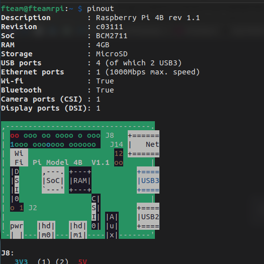

Florent VASSEUR--BERLIOUX, Tom BOGAERT, Assia GOUABI, Enzo GUIGNOLLE, Matthieu FARANDJIS 
INF2-A

# SAÉ S3 - Installation du RPi4

  
Ce document décrit en détail le processus d'installation du RPi4, de son serveur LAMP, de sa mise en réseau, du ssh et de sa sécurisation. 
Les étapes décrites sont également appliqués au serveur de secours. Ce document aborde aussi la configuration du routeur. 

       

---

## Plan

- ### [I – Présentation](#p1)
    - [**a) Présentation du RaspberryPi 4**](#p1a)
    - [**b) Présentation de RaspberryPi OS Lite**](#p1b)

- ### [II – Préparatif](#p2)
  - [**a) Matériels nécessaires**](#p2a)
  - [**b) Logiciels nécessaires**](#p2b)
  - [**c) Installation de RaspberryPi OS Lite**](#p2c)
  
- ### [III - Installation du serveur LAMP](#p3)
  - [**a) Premier démarrage de RaspberryPi OS Lite**](#p3a)
  - [**b) Installation d'Apache**](#p3b)
  - [**c) Installation de MariaDB**](#p3c)
  - [**d) Installation de PHP**](#p3d)
  - [**e) Installation de PHPMyAdmin**](#p3e)

- ### [IV - Mise en réseau via Hamachi](#p4)
  - [**a) Présentation de LogMeIn Hamachi**](#p4a)
  - [**b) Installation**](#p4b)
  - [**c) Problèmes rencontrés**](#p4c)
  - [**d) Hypothèse sur ces problèmes**](#p4d)
  - [**e) Résolution des problèmes**](#p4d)

- ### [V - Sécurisation](#p5)
  - [**a) Pare feu**](#p5a)
    - [i) Pare feu du routeur](#p5ai)
    - [ii) Pare feu du RPi 4](#p5c5aii)
  - [**b) Emplacement des fichiers et alias**](#p5b)
  - [**c) Les utilisateurs et leurs droits**](#p5c)
    - [i) Liste des utilisateurs](#p5ci)
    - [ii) Droits des utilisateurs](#p5cii)

   

---

##  I - Présentation

  - ###  a) Présentation du RaspberryPi 4
    Le RaspberryPi est un micro ordinateur monocarte apparu en février 2012. Excepté l'alimentation et un support de stockage,
    nous y retrouvons tout le nécessaire pour le faire fonctionner comme un processeur et de la mémoire vive. 
    Comme pour la majorité des ordinateurs, celui-ci propose des ports pour y brancher un écran, des périphériques, une alimentation, une caméra ou encore un câble ethernet. 
     
    Cependant, le RPi 4 comporte des différences avec les anciens modèles de RPi. 
    En termes de processeur, son CPU possède des cœurs plus récents (les Cortex-A72) et son GPU est 25% plus rapide que les précédents modèles :
    désormais sa résolution d'écran maximal est de la 4K UltraHD. Son port HDMI/Mini-HDMI a laissé place à deux ports micro HDMI. 
    Concernant la mémoire vive passant de LPDDR2 à LPDDR4 d'ailleurs, il y a quatre versions du RPi4 : une 1Go, une 2Go, 8Go et une à 4Go, la nôtre. 
    Deux de ses ports USB 2 ont laissé place à deux ports USB 3, et en termes de connectique réseau, le RPi4 possède un meilleur port LAN, un meilleur Wi-Fi et un meilleur Bluetooth. 
     
    Nous pouvons en apprendre plus sur les caractéristiques de notre Raspberry Pi 4 en exécutant la commande Raspberry OS : pinout 
     
    

     
    <i>résultat de la commande pinout</i>
    

     
     
    Comme précédemment dit, Le RPi 4 possède un processeur ARM Cortex-A72. Même si c'est un processeur 64bits, c'est un processeur faisant partie de la famille ARMv8 et non des x86 comme on le retrouve souvent sur nos PC. 
    Les processeurs ARM sont principalement utilisé pour "les appareils compacts et tendent à optimiser l'autonomie, la taille, le refroidissement et surtout, les coûts" selon RedHat. Ce qui correspond aux critères du RPi 4 : être un mini ordinateur abordable 
    On remarque cependant que selon RedHat, l'architecture x86 est plutôt utilisé pour les serveurs pour leur vitesse. Ainsi, en dehors du cadre de cette SAÉ, utiliser RaspberryPi comme serveur n'est pas le mieux. 
     
    On remarque aussi le préfixe "LP" de "LPDDR4" comme type de mémoire vive du RPi4. "LP" pour "Low Power" est une version plus petite et moins consommatrice en termes de ressources que le simple DDR "Double Data Rate". 
    La DDR a remplacé la SDRAM au début des années 2000 par sa rapidité : "La DDR transfère les données au processeur à la fois dans la phase montante et descendante des signaux d’horloge" selon Crucial. 
    Encore une fois, c'est un composant adapté pour les appareils compacts comme le RaspberryPi. 
    
      
    **Sources :**
    - https://www.jmdoudoux.fr/raspberry/raspberry_pi_4_modele_B.htm
    - https://www.conrad.fr/fr/guides/materiel-educatif-kits-de-developpement/raspberry-pi.html
    - https://fr.wikipedia.org/wiki/Raspberry_Pi
    - https://www.raspberrypi.com/products/raspberry-pi-4-model-b/
    - https://fr.wikipedia.org/wiki/ARM_Cortex-A72
    - https://www.redhat.com/fr/topics/linux/ARM-vs-x86
    - https://www.hardware.fr/news/13047/quelques-details-lpddr4-ddr4-wide-i-o.html
    - https://fr.msi.com/blog/ultra-thin-business-and-productivity-laptop-with-lpddr4x-memory
    - https://www.crucial.fr/articles/about-memory/difference-among-ddr2-ddr3-ddr4-and-ddr5-memory
    - https://fr.wikipedia.org/wiki/LPDDR

  - ###  b) Présentation de RaspberryPi OS Lite

    RaspberryPi OS Lite est la version de RaspberryPi OS sans interface graphique. 
    Cette version permet de démarrer le RPi4 sans écran, sans clavier et sans souris. Elle pèse près de 600 Mo, c'est donc le système idéal pour notre serveur. 
    Bien que nous savons utiliser le terminal, le cas échéant, il est toujours possible d'ajouter une interface graphique à Raspberry OS Lite. 
     
    RaspberryPi OS est fondé sur le système d'exploitation gratuit Debian et est conçu spécialement pour le RaspberryPi. 
    En effet, au lancement de Raspbian, l'ancien nom de l'OS, Debian n'était pas disponible pour la famille de processeur du RaspberryPi : l'ARMv6. 
    Vu que ce système d'exploitation est dédié au RaspberryPi, il comporte des commandes dédiées au micro ordinateur comme "raspi-config" ou encore "pinout" cité plus tôt. 
    Ubuntu étant aussi issu sur Debian, nous pouvons aussi bien s'aider de la documentation de Raspberry OS, que celle de Debian ou celle d'Ubuntu. 
    Pour notre serveur de secours, nous utiliserons Ubuntu Server. L'installation du serveur LAMP et de LogMeIn Hamachi reste pratiquement la même. 

    Sources :
    - https://www.raspberrypi.com/documentation/
    - https://raspberrytips.fr/raspberry-pi-os-versions/
    - https://alain-michel.canoprof.fr/eleve/tutoriels/raspberry/premiers-pas-raspberrypi/activities/utiliser-raspi-config.html
    - https://www.macg.co/ailleurs/2023/10/les-raspberry-pi-passent-bookworm-pour-le-nouvel-os-139771

   

---

##  II - Préparatif

  - ###  a) Matériels nécessaires
    Pour utiliser le RPi4 sur le même écran de son ordinateur tout en l'utilisant, on peut utiliser un boitier d'acquisition. 
    C'est un adaptateur HDMI vers USB, permettant de récupérer le signal vidéo sur son ordinateur. Utile pour enregistrer l'écran du RPi4 par exemple. 

     
    Pour procéder à l'installation du système, il faut au préalable avoir :  

    - **Un RaspberryPi et son alimentation** 
      Monsieur Hoguin nous a confié un RaspberryPi 4 modèle B. C'est un mini ordinateur à manipuler avec précaution. En effet, il n'est pas dans un boitier. 
      Son alimentation se branche au RPi4 via son port USB type C.  
    
    - **Une carte microSD** 
      Monsieur Hoguin nous a donné une carte micro SD Verbatim de 16Go. 
      Le RPi4 est réputé comme étant un tueur de carte micro SD. Nous devons donc archiver régulièrement l'intégralité du contenu de cette carte.  
    
    - **Un câble HDMI et son adaptateur vers micro HDMI** 
      Le RPi4 se branche en micro HDMI. Ayant un câble HDMI, un adaptateur était nécessaire. Il nous a coûté 3€ à la FNAC.  
  
    - **Un clavier d'ordinateur** 
      Un clavier d'ordinateur basique se branchant en USB suffit.  
    
    - **Un câble ethernet** (préférable) 
      Brancher un câble ethernet permet de vérifier grâce aux leds que le RPi4 soit bien connecté au réseau. 
      On peut aussi connecter le RPi4 en Wi-Fi. Mais grâce au câble nous sommes assurés de ne pas accuser la connexion si on rencontre des problèmes dans la plupart des cas.

 

  - ###  b) Logiciels nécessaires

    Pour installer un système sur un support dédié au RaspberryPi, le plus simple est d'utiliser le logiciel "Pi Imager". 

     
    En dehors du logiciel Pi Imager, vu que nous possédons un boitier d'acquisition, nous allons utiliser les logiciels VLC et Mirillis Action!. 
    VLC permettra d'afficher sur son ordinateur la sortie vidéo du boitier provenant du RPi4, et Action! permettra en même temps d'enregistrer celui-ci et même le bureau Windows. 
    Grâce aux vidéos, nous pouvons décrire précisément l'installation du système et la résolution des problèmes rencontrés. 
    Des captures d'écran de ces vidéos illustrons ce document. 

      

    

        
       <i>VLC affichant l'écran du RPi4 sur Windows 10</i>
    

- ###  c) Installation de Raspberry OS Lite

    À partir du bouton "Choisir l'OS", Pi Imager propose différents systèmes pouvant être installé. On peut aussi installer son propre système. 
    Nous avons choisi Raspberry OS Lite pour les raisons évoquer lors de la présentation de ce système.

      

    

         
        <i>Menu de Pi Imager</i>
    

  
     

    Une fois avoir sélectionné le système, un petit bouton engrenage apparaît pour paramétrer l'installation de RaspberryPi OS Lite. 
    On peut y donner un nom à l'ordinateur, activer SSH, modifier le login et le mot de passe de l'utilisateur par défaut, configurer le Wi-Fi, le clavier ou encore le fuseau horaire. 
    Nous avons configuré l'installation par rapport à notre besoin. Il est tout à fait possible de le faire plus tard avec la commande "raspi-config". 
     
    Les trois cases à cocher tout en bas ne sont pas très importante. 
    La télémétrie correspond à l'envoi de pings à raspberry.org pour des fins de statiques, c'est inutile, ça ne restreint pas l'utilisation du système, nous l'avons donc désactivé pour ne pas être surveillé. 
      

    

         
        <i>Options d'installation de Pi Imager</i>
    

     

    Une fois fait, il suffit de sélectionner le bon lecteur et de flasher la carte microSD. C'est assez rapide, et la carte microSD est immédiatement opérationnel.
    
    Source utilisée :
    - https://framboise-pi.skyost.eu/article/maitriser-raspberry-pi-imager/

   

---

##  III - Installation du serveur LAMP

- ###  a) Premier démarrage de RaspberryPi OS Lite
    Il n'y a rien de particulié qui se passe durant le premier démarrage. 
    Il nous demande notre login et le mot de passe que nous avons précisé sur Pi Imager et on a directement accès à RaspberryPi OS Lite. 
    Le cas échéant, l'utilisateur par défaut est "pi" et son mot de passe est "password". 
     
    En revanche, attention ! 
    Vu que nous avons activé SSH via Pi Imager, celui-ci est déjà activé. Cela peut poser des soucis de sécurité notamment si on a laissé l'utilisateur par défaut !

- ###  b) Installation d'Apache

    Apache est un serveur web open-source HTTP et multiplateforme populaire apparu en 1995. En 2004, il atteint un pic de 69% de parts du marché.
    Il est activement maintenu par l’Apache Software Foundation, sa dernière version, la 2.4.58 est sorti le 19 octobre 2023. 
     
    Nous n'avons pas rencontré de difficulté pour son installation, il suffit seulement d'exécuter la commande : sudo apt install apache2 
     
    **Pour rappel :** 
    SUDO permet de s'octroyer le temps de cette commande les droits root. 
    APT pour "Advanced Packaging Tool" est, selon la documentation d'Ubuntu, un système complet et avancé de gestion de paquets permettant la recherche, l'installation et la désinstallation facile de logiciels et utilitaires. 
    APACHE2 est le serveur que nous allons utiliser. Sur RedHat, son nom est HTTPD. 
     
     
    Une fois installé, Apache2 est directement exécuté. Nous pouvons voir son statut en exécutant la commande : systemctl status apache2. 
    Pour le démarrer, on doit utiliser la commande : systemctl start apache2 
    Pour le redémarrer : systemctl restart apache2 
    Pour l'arrêter : systemctl stop apache2 
     
    🟨 Mettre ici une image du statut d'Apache2 
     
    Étant donné que nous utilisons un système d'exploitation sans interface graphique, nous ne pouvons pas vérifier visuellement que la page par défaut d'Apache apparaît correctement. 
    Pour cela, il suffit d'utiliser un autre ordinateur du réseau local et de taper l'adresse IP local du RaspberryPi 4. Nous pouvons la connaître via la commande ifconfig en installant au préalable le paquet net-tools 
    En faisant cela, nous obtenons la page par défaut d'Apache index.html pour serveur Debian. 
     
    🟨 Mettre ici une image de la page par défaut d'Apache 
     
    Attention ! 
    Il est possible qu'au prochain démarrage du routeur, celui-ci change l'adresse IP local assigné Au RPi4. 
    Il est possible d'assigner une adresse IP local statique au RPi4 en se connectant en tant qu'administrateur à celle-ci. La manipulation dépend du routeur. 
     
    Remarque : 
    Si la page index.html n'arrive pas à être chargé (chargement infini) mais que le fichier existe bien, vérifiez si le pare-feu de votre routeur ainsi que celui de RaspberryPi OS Lite autorise l'utilisation du port 80. 
    Par défaut, RaspberryPi OS ne possède pas de pare-feu. Il est possible que le problème vienne d'ailleurs sinon. 

    Sources :
  - https://fr.wikipedia.org/wiki/Apache_HTTP_Server
  - https://doc.ubuntu-fr.org/apache2
  - https://doc.ubuntu-fr.org/apt
  - Rapport de la SAÉ 2.03 par Matthieu FARANDJIS et Tom BOGAERT

- ###  c) Installation de MariaDB
    MariaDB est un système de gestion de base de données relationnelle open source qui est largement utilisé en tant qu'alternative à MySQL. 
    Il a été créé par les développeurs d'origine de MySQL après l'acquisition de MySQL par Oracle Corporation. 
    MariaDB est conçu pour être un remplacement direct de MySQL, en offrant une compatibilité élevée avec les applications et les outils existants utilisant MySQL. 
     
    **Pour l’installation de MariaDB on utilise la commande :** sudo apt install mariadb-server 
     
    Tout comme Apache2, MariaDB-server est un service, nous pouvons utiliser systemctl dessus. Par défaut, une fois installé il démarre et il redémarre à chaque démarrage de RPi OS sauf si on lui interdit. 
     
    🟨 Mettre ici une image de MariaDB 

      
    **Source :**
  - Rapport de la SAÉ 2.03 par Matthieu FARANDJIS et Tom BOGAERT

- ###  d) Installation de PHP
- ###  e) Installation de PHPMyAdmin