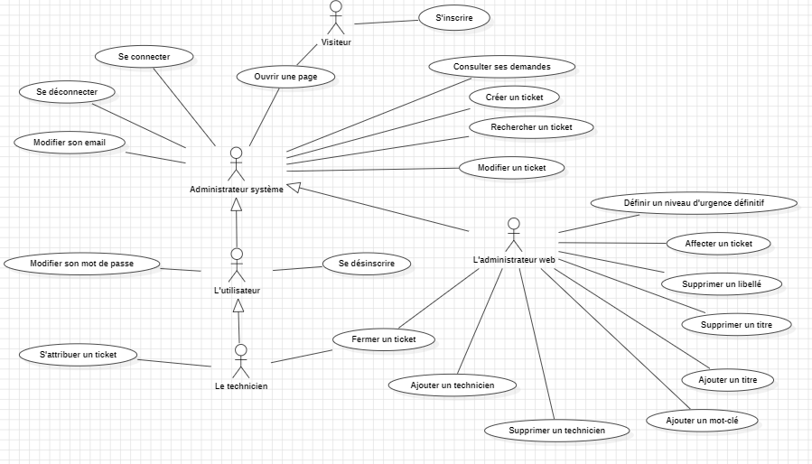

Florent VASSEUR--BERLIOUX, Tom BOGAERT, Assia GOUABI, Enzo GUIGNOLLE, Matthieu FARANDJIS<br>
INF2-A

<div align="center">


# SAÉ S3 - Recueil des besoins

<br><br>
Ce document rassemble toutes les informations importantes que nous devrons respecter pour mener à bien ce projet.

</div>


<br><br><br><br><br><br><br>

## Plan

### [I – Objectif et portée](#p1)
- <b>[a) Quels sont la portée et les objectifs généraux ?](#p1a)</b>
- <b>[b) Lecture du cahier des charges](#p1b) </b>
    - <u>[i. Liste des objets, acteurs et actions](#p1bi) </u>
    - <u>[ii. Les différents niveaux](#p1bii) </u>
    - <u>[iii. Un schéma descriptif des niveaux](#p1biii) </u>
    - <u>[iiii. Le diagramme des cas d'utilisation](#p1biiii) </u>
### [II – Terminologie employée / Glossaire](#p2)
### [III – Les cas d’utilisation](#p3)
- <b>[a) Les acteurs principaux et leurs objectifs généraux](#p3a).</b>
- <b>[b) Les cas d’utilisation métier (concepts opérationnels).](#p3b)</b>
- <b>[c) Les cas d’utilisation stratégique.](#p3c)</b>
- <b>[d) Les cas d’utilisation utilisateur et système.](#p3d)</b>
### [IV – La technologie employée](#p4)
- <b>[a) Quelles sont les exigences technologiques pour ce système ?](#p4a)</b>
- <b>[b) Avec quels systèmes ce système s’interfacera-t-il et avec quelles exigences ?](#p4b)</b>
### [V – Autres exigences](#p5)
- <b>[a) Processus de développement](#p5a)</b>
    - <u>[i. Qui sont les participants au projet ?](#p5ai)</u>
    - <u>[ii. Quelles valeurs devront être privilégiées ? (exemple : simplicité, disponibilité, rapi-
      dité, souplesse etc... )](#p5aii)</u>
    - <u>[iii. Quels retours ou quelle visibilité sur le projet les utilisateurs et commanditaires
      souhaitent-ils ?](#p5aiii)</u>
    - <u>[iv. Que peut-on acheter ? Que doit-on construire ? Qui sont nos concurrents ?](#p5aiv)</u>
    - <u>[v. Quels sont les autres exigences du processus ? (exemple : tests, installation, etc...)](#p5av)</u>
    - <u>[vi. À quelle dépendance le projet est-il soumis ?](#p5avi)</u>
- <b>[c) Performances](#p5c)</b>
- <b>[d) Opérations, sécurité, documentation](#p5d)</b>
- <b>[e) Utilisation et utilisabilité](#p5e)</b>
- <b>[f) Maintenance et portabilité](#p5f)</b>
- <b>[g) Questions non résolues ou reportées à plus tard](#p5g)</b>
### [VI – Recours humain, questions juridiques, politiques, organisationnelles.](#p6)
- <b>[a) Quel est le recours humain au fonctionnement du système ?v</b>](#p6a)
- <b>[b) Quelles sont les exigences juridiques et politiques ?](#p6b)</b>
- <b>[c) Quelles sont les conséquences humaines de la réalisation du système ?](#p6c)</b>
- <b>[d) Quels sont les besoins en formation ?](#p6d)</b>
- <b>[e) Quelles sont les hypothèses et les dépendances affectant l’environnement humain ?](#p6e)</b>

### [Annexe 1 : Cas d'utilisation](#a1)


<br><br><br><br><br><br><br>

------------------------------------------------------------------------------------------------------------------------
### <a name="p1"></a>I – Objectif et portée
- <b><a name="p1a"></a>a) Quels sont la portée et les objectifs généraux ?</b><br>

La portée de l'utilisation de l'application s'arrête au réseau internet de l'IUT.
Aucun utilisateur ne peut l'utiliser en dehors de ce réseau.<br>
Indépendamment de la communication entre le client et le serveur, l'application ne communique pas avec les autres serveurs de l'IUT.
On peut ainsi dire que sa portée d'exécution s'arrête au serveur du RaspberryPi 4.
<br>
L'application s'adresse à différents acteurs comme les professeurs et les étudiants.
Ce n'est pas un système purement interne ne concernant que les techniciens et les administrateurs pour la gestion des salles machines.<br>
<br>


- <b><a name="p1b"></a>b) La lecture du cahier des charges </b>

    - i)<a name="p1bi"></a> Liste des objets, acteurs et actions


<table>
<colgroup>
<col span="1" style="background-color: dimgray">
<col span="1" style="background-color: darkslateblue">
<col span="1" style="background-color: rebeccapurple">

</colgroup>
<tr>
    <th>Objets</th>
    <th>Acteurs</th>
    <th>Actions</th>
</tr>
<tr>
    <td> Une application web (la plateforme)</td>
    <td> Client </td>
    <td> - Recueillir les demandes de dépannages <br> - Accueillir quatre types d'utilisateurs </td>
</tr>
<tr>
    <td> Le ticket (les demandes de dépannage)</td>
    <td> Des utilisateurs (étudiants et professeurs)</td>
    <td> - Afficher les différentes demandes (tickets) et leurs statuts <br> - Ouvrir un ticket <br> - Accéder à son tableau de bord et à son profil utilisateur </td>
</tr>
<tr>
    <td> Un formulaire d'inscription </td>
    <td> Un visiteur </td>
    <td> - Remplir un formulaire pour devenir utilisateur <br> - Accéder à la page d'accueil</td>
</tr>
<tr>
    <td> La base de données </td>
    <td> Un administrateur web </td>
    <td> - Se connecter <br> - Gérer la liste des libellés affectés aux différents problèmes <br> - Définir les statuts des tickets et leurs niveaux d'urgence <br> - Créer les comptes des techniciens et peut leur affecter des tickets <br> - Se déconnecter </td>
</tr>
<tr>
    <td> Le statut des tickets </td>
    <td> Des techniciens </td>
    <td> - Se connecter <br> - S'attribuer un ticket <br> - Changer le statut d'un ticket <br> - Se déconnecter </td>
</tr>
<tr>
    <td> Les journaux d'activité </td>
    <td> Un administrateur système </td>
    <td> - Accéder aux journaux d'activité <br> - Stocker des données de connexion infructueuse </td>
</tr>
<tr>
    <td> La page d'accueil </td>
    <td></td>
    <td> - Explique le but de la plateforme avec une vidéo de démonstration la présentant<br>
         - Afficher les 10 dernières demandes
    </td>
</tr>
<tr>
    <td> Un historique </td>
    <td></td>
    <td> - Stocker les tickets fermés </td>
</tr>
<tr>
    <td> Un tableau de bord </td>
    <td></td>
    <td> - Afficher la liste des tickets publiés et leur état</td>
</tr>
<tr>
    <td> La liste des libellés </td>
    <td></td>
    <td></td>
</tr>
<tr>
    <td> Les niveaux d'urgence des tickets </td>
    <td></td>
    <td></td>
</tr>
<tr>
    <td> Le système </td>
    <td></td>
    <td></td>
</tr>
<tr>
    <td> Un profil utilisateur </td>
    <td></td>
    <td> - Changer son mot de passe</td>
</tr>


</table>
<br>

- - <a name="p1bii"></a>ii) Les différents niveaux

    
| Niveau stratégique (au-dessus de la mer) | Niveau utilisateur (de la mer)                                                                                                                                                                                                  | Niveau sous-fonctions (en-dessous de la mer) |
|------------------------------------------|---------------------------------------------------------------------------------------------------------------------------------------------------------------------------------------------------------------------------------|----------------------------------------------|
| Gérer les profils utilisateurs           | - Modifier son mot de passe <br><br> - Modifier son Email <br><br> - S'inscrire <br><br> - Se désinscrire                                                                                                             | - Se connecter <br><br> - Se déconnecter     |
| Gérer les demandes de tickets            | - Créer un ticket <br><br> - Modifier un ticket <br><br> - Consulter ses demandes <br><br> - Rechercher un ticket <br><br> - Affecter un ticket <br><br> - S'attribuer un ticket <br><br> - Définir un niveau d'urgence définitif <br><br> - Fermer un ticket |                                              |
| Administrer la plateforme                | - Ajouter un technicien <br><br> - Supprimer un technicien <br><br> - Ajouter un titre <br><br> - Supprimer un titre <br><br> - Ajouter un mot-clé <br><br> - Supprimer un libellé                                              |                                              |
|                                          | - Ouvrir une page                                                                                                                                                                                                               | - Afficher une page                          |

                                                                            
<br>

- - <a name="p1biii"></a>iii) Un schéma descriptif des niveaux


- - <a name="p1biiii"></a>iiii) Le diagramme des cas d'utilisation



<br><br><br><br><br><br><br>
------------------------------------------------------------------------------------------------------------------------
### <a name="p2"></a>II – Terminologie employée / Glossaire

Par ordre alphabétique.

| Mots                   | Définition                                                                                                                                                                                                                               |
|:-----------------------|:-----------------------------------------------------------------------------------------------------------------------------------------------------------------------------------------------------------------------------------------|
| CNIL                   | Commission Nationale de l'Informatique et des Libertés. Autorité administrative indépendante française chargée de veiller notamment à ce que l’informatique soit au service du citoyen.                                                  |
| Connexion infructueuse | L'échec d'une tentative de connexion à un système ou à un compte utilisateur en raison d'informations incorrectes ou d'un problème technique.                                                                                            |
| Cookie                 | (en informatique) : Petit fichier stocké par un serveur dans le terminal (ordinateur, téléphone, etc.) d’un utilisateur et associé à un domaine web.                                                                                     |
| Demande de dépannage   | Une requête soumise par un utilisateur pour signaler un problème ou une difficulté technique qui nécessite une intervention ou une résolution (Ticket) par l'équipe de support informatique.                                             |
| Injection SQL          | Technique permettant d’injecter des éléments de type SQL dans les champs des formulaires web ou dans les liens des pages afin de les envoyer au serveur web dans l'objectif de modifier des éléments présents dans une base de données. |
| Libellés               | Des étiquettes ou des mots-clés attribués à un ticket informatique pour catégoriser, organiser et faciliter la recherche des problèmes similaires ou des demandes de support.                                                            |
| RGPD                   | Règlement Général sur la Protection des Données. Texte de référence en matière de protection des données à caractère personnel. Il renforce et unifie la protection des données pour les individus au sein de l'Union européenne.        |
| RPi4                   | Raspberry Pi 4 un ordinateur monocarte de petite taille développé par la Fondation Raspberry Pi.                                                                                                                                         |
| Scenario               | Séquence d'actions qui se déroulent dans une situation donnée ou une histoire                                                                                                                                                                                                                                        |
| SGBD                   | Système de Gestion de Base de Données.                                                                                                                                                                                                   |
| Support informatique   | L'assistance technique qui réalise la gestion des demandes d'assistance, le dépannage des problèmes techniques, la résolution des questions liées à l'informatique.                                                                      |
| Tableau de bord        | Une interface en ligne qui affiche des informations récapitulatives et des données clés pour aider les utilisateurs à surveiller et à gérer les opérations liées aux tickets et au support informatique.                                 |
| Ticket                 | Enregistre une tâche effectuée (ou qui doit être effectuée) par le système de support informatique afin de rectifier les problèmes, résoudre les demandes des clients.                                                                   |
| W3C                    | World Wide Web Consortium. Organisme international définissant les standards techniques liés au web et les règles à respecter pour tous les développeurs du monde.                                                                       |
| Wave                   | Extension de navigateur internet permettant d'évaluer l'accessibilité d'une page web pour les personnes souffrant de handicap.                                                                                                           |


<br><br><br><br><br><br><br>
------------------------------------------------------------------------------------------------------------------------
### <a name="p3"></a>III – Les cas d’utilisation

- <b>a) Les acteurs principaux et leurs objectifs généraux.</b><br>
  <br>

    - <u>Le visiteur (un ou plusieurs) :</u><br>
      > - S'inscrit
      > - Accède à la page d’accueil
      > - Consulte les 10 dernières demandes de dépannage

  <br>
  Pour différencier un utilisateur d’un visiteur. Les visiteurs doivent s’inscrire, remplir un formulaire pour devenir utilisateur.<br>
  <br>

    - <u>L’utilisateur (un ou plusieurs) :</u><br>
      > - Se connecte, se déconnecte
      > - Ouvre un ticket
      > - Accède à son tableau de bord
      > - Accède à son profil
      > - Change son mot de passe

  <br>

    - <u>Les techniciens (deux) :</u><br>
      > - Est un utilisateur, mais avec plus de droit
      > - S'attribue ou affecte un ticket à un technicien
      > - Change l'état d'un ticket

  <br>

    - <u>L’administrateur web (un seul) :</u><br>

      > - Est un technicien, mais avec en plus des droits d'administration
      > - Affecte/Retire des libellés aux tickets
      > - Définis le statut des tickets
      > - Définis le niveau d'urgence d'un ticket
      > - Créer des comptes techniciens
      > - Résout les problèmes liés à l'authentification de l'utilisateur

  <br>

    - <u>L’administrateur système (un seul) :</u><br>
      > - Est un technicien, mais avec en plus des droits d'administration
      > - Accède et utilise les journaux d'activités

- <b>b) <a name="p3b"></a> Les cas d’utilisation métier (concepts opérationnels).</b>

- <b>c) <a name="p3c"></a> Les cas d'utilisation stratégique <b>
    - [Gérer les profils utilisateurs](#a1cu22)
    - [Gérer les demandes de tickets](#a1cu23)
    - [Administrer la plateforme](#a1cu24)
    
- <b>d) <a name="p3d"></a> Les cas d’utilisation utilisateur et système.</b>
  - [Afficher une page](#a1cu1)
  - [Ouvrir une page](#a1cu2)
  - [Se connecter](#a1cu3)
  - [Se déconnecter](#a1cu4)
  - [S'inscrire](#a1cu5)
  - [Modifier son mot de passe](#a1cu6)
  - [Modifier son Email](#a1cu7)
  - [Consulter ses demandes](#a1cu8)
  - [Créer un ticket](#a1cu9)
  - [Modifier un ticket](#a1cu25)
  - [Rechercher un ticket](#a1cu10)
  - [Se désinscrire](#a1cu11)
  - [Affecter un ticket](#a1cu12)
  - [S'attribuer un ticket](#a1cu13)
  - [Définir un niveau d'urgence définitif](#a1cu14)
  - [Fermer un ticket](#a1cu15)
  - [Ajouter un technicien](#a1cu16)
  - [Supprimer un technicien](#a1cu17)
  - [Ajouter un titre](#a1cu18)
  - [Supprimer un titre](#a1cu19)
  - [Ajouter un mot-clé](#a1cu20)
  - [Supprimer un libellé](#a1cu21)
  
<br><br><br><br><br><br><br>
------------------------------------------------------------------------------------------------------------------------

### <a name="p4"></a>IV – La technologie employée
- <b><a name="p4a"></a>a) Quelles sont les exigences technologiques pour ce système ?</b>

  L'application devra utiliser : SQL, HTML, CSS et PHP<br>
    - SQL est le langage utilisé pour l'utilisation d'un SGBD comme MySQL<br>
    - HTML et CSS permettent la création des pages web du site internet.<br>
    - PHP permet de son côté de personnaliser les pages en fonction de l'utilisateur et des données de l'application.<br>

  <br>
  MySQL est le Système de Gestion de Base de Données (SGBD) proposé par le client.<br>
  <br>
  Nous utiliserons les logiciels PHPStorm, WebStorm de Jetbrains.<br>
  Ces outils ne sont pas contraints mais nous permettrons d’améliorer la qualité du code rendu.<br>
<br>

- <b><a name="p4b"></a>b) Avec quels systèmes ce système s’interfacera-t-il et avec quelles exigences ?</b>

  Afin de garantir le bon fonctionnement de l’application web finale, il faudra s’assurer que le serveur web soit prêt à l’utilisation sur une carte SD.<br>
  De plus, il sera nécessaire d’assurer le bon fonctionnement du site web sur les postes présents dans les salles machines de l’IUT de Vélizy.<br>
  La carte SD se devra de contenir un serveur web (Apache est conseillé) ainsi qu’un serveur SGBD.<br>
  Aussi, le serveur contenant l’application web sera porté sur Raspberry Pi 4 et sera accessible par connexion SSH.<br>

<br><br><br><br><br><br><br>
------------------------------------------------------------------------------------------------------------------------

### <a name="p5"></a>V – Autres exigences


- <b><a name="p5a"></a>a) Processus de développement</b>

    - <u><a name="p5ai"></a>i. Qui sont les participants au projet ?</u><br>

      Les membres de notre équipe sont les principaux participants au projet.
      Notre équipe est constituée de Tom BOGAERT, Matthieu FARANDJIS, Assia GOUABI, Enzo GUIGNOLLE et Florent VASSEUR--BERLIOUX.<br>
      <br>
    - <u><a name="p5aii"></a>ii. Quelles valeurs devront être privilégiées ? (exemple : simplicité, disponibilité,    rapidité, souplesse etc... )</u><br>

      Nous priviligerons l'efficacité de nos algorithmes, mais egalement la sécurité de nos bases de données. Un point d'honeur sera egalement mis sur la disponibilité de notre application web et, plus généralement, sur sa simplicité de prise en main. Nous favoriserons au mieux la conpréhension et la communication entre les utilisateurs, techniciens et administrateurs.<br>
      1
      <br>
    - <u><a name="p5aiii"></a>iii. Quels retours ou quelle visibilité sur le projet les utilisateurs et commanditaires
      souhaitent-ils ?</u><br>

      Ce projet représentant un travail scolaire évalué, les commanditaires de ce projet sont nos enseignants. Ces derniers ont une grande visibilité sur l'avancée du projet et recevront à certaines dates des documents concernants le projet et son avancée. La communication entre les membres de l'équipe et les enseignants est recommandée afin d'assurer le rendu d'un projet fidèle aux attentes de ces derniers.<br>
      <br>
    - <u><a name="p5aiv"></a>iv. Que peut-on acheter ? Que doit-on construire ? Qui sont nos concurrents ?</u><br>

      Le projet est de concevoir et programmer un site web de gestion de tickets. Aucun achat n'est nécessaire à la création de la plateforme web, puisque le matériel (RPi4) est pris en charge par le client.
      Nous ne possédons pas de concurrents à proprement parlé.<br>
      <br>
    - <u><a name="p5av"></a>v. Quels sont les autres exigences du processus ? (exemple : tests, installation, etc...)</u><br>

      Nous pouvons noter en exigences sur le projet, l'exécution d'une phase de test assurant le bon fonctionnement de l'application. On attend également le rendu d'annexes concernant l'organisation du travail de l'équipe ou encore la charte graphique du logo de l'application.<br>
      Le projet se fera sous forme de petit cycle en cascade pour chaque élément du projet. Par exemple, des pages web statique ou encore du code PHP. On commencera par la conception, puis la création pour terminer avec les tests.
      Les clients doivent avoir accès au dépôt Git afin de juger de l'évolution du projet et faire des critiques si nécessaire.
      <br>
    - <u><a name="p5avi"></a>vi. À quelle dépendance le projet est-il soumis ?</u><br>
      Ce projet n'a pas de dépendance en raison de la stagnation des langages PHP et MySQL.

<br>

- <b><a name="p5c"></a>c) Performances</b><br>

  Le site web se devra d'être le plus performent possible afin d'en faciliter l'accès. Pour se faire, les programmes effectués en PHP seront optimisés et testés dans le but de limiter le nombre de boucles et d'actions. Les systèmes de stockages de données seront choisis en conséquences pour améliorer au mieux les performences de la plateforme. Nous ne possédons pas de réelles contraintes de performances.

<br>

- <b><a name="p5d"></a>d) Opérations, sécurité, documentation</b><br>

  Tous le code étant utilisé pour mener le projet à bien se devra d'être documenté afin d'assurer la lisibilité du programme. Toutes les fonctions générées seront accompagnées d'une Docstring.

  L'ensemble du programme sera également rendu imperméable aux attaques de type Injection SQL. Le système sera protégé et restreindra les actions des utilisateurs afin de les empêcher de se détourner des indications de la plateforme web. Les mots de passe seront encryptés.

<br>

- <b><a name="p5e"></a>e) Utilisation et utilisabilité</b><br>

  Nous veillerons à rendre l’application accessible en se basant sur la norme UAAG 2.1 de W3C. Nous utiliserons l'extension de navigateur internet "Wave" pour s'en assurer.
  
<br>

- <b><a name="p5f"></a>f) Maintenance et portabilité</b><br>

  La portabilité et la maintenance de l'application web sera notamment vérifié en passant par le validateur de W3C. Il permet de s'assurer la compatibilité de la plateforme avec tous les navigateurs, et permet de s'assurer que le code est conforme avec les exigences actuels.
  PHP et MySQL fonctionnent aussi bien sur un serveur Windows que sur un serveur Linux.

<br>

- <b><a name="p5g"></a>g) Questions non résolues ou reportées à plus tard</b><br>

  La présence de Javascript n'étant pas demandée, nous ne prévoyons pas d'en utiliser sur les pages web. Cependant, nous nous octroyons la possibilité d'en faire usage si nécessaire lors de nos phases de conception et de programmation.
  <br><br><br><br><br><br><br>
------------------------------------------------------------------------------------------------------------------------

### <a name="p6"></a>VI – Recours humain, questions juridiques, politiques, organisationnelles.
- <b><a name="p6a"></a>a) Quel est le recours humain au fonctionnement du système ?</b><br>
  Le système fonctionnera en toute autonomie sur un serveur pour pouvoir être utilisé par les différents utilisateurs.<br>
  Le démarrage et la maintenance du système doivent être faits par du personnel qualifié comme l'administrateur système.<br>
  <br>
  Si le système est capable d'inscrire de lui-même un visiteur du moment qu'il valide le captcha, ce n'est pas le cas pour les techniciens.<br>
  En effet, quand bien même il passe par la plateforme, l'administrateur web doit les inscrire de lui-même.<br>
  Il en va de même pour la réinitialisation de mot de passe en cas d'oubli.<br>
  <br>
  L'application propose différentes actions pour les utilisateurs, qu'ils doivent actionner d'eux même. L'application ne fait que de les mettre en application.<br>
  <br>
- <b><a name="p6b"></a>b) Quelles sont les exigences juridiques et politiques ?</b><br>
  L'application se doit de respecter la loi française « Informatique et liberté » du 6 janvier 1978, mise à jour le 1er juin 2019, relative à l'informatique, aux fichiers et aux libertés.<br>
  L'application est également soumise au règlement européen « Règlement Général sur la Protection des Données » (RGPD) du 27 avril 2016, relatif à la protection des personnes physiques à l'égard du traitement des données à caractère personnel et à la libre circulation de ces données, et abrogeant la directive 95/46/CE.<br>
  <br>
  A noter, la CNIL propose des recommandations vis à vis de la loi, notamment en matière de cookies.<br>
  <br>
  Les articles peuvent être consultés via les liens ci-dessous :
    - <u>Loi « Informatique et liberté » :</u><br>
      https://www.cnil.fr/fr/la-loi-informatique-et-libertes <br>
    - <u>Règlement européen « Règlement Général sur la Protection des Données » :</u><br>
      https://www.cnil.fr/fr/reglement-europeen-protection-donnees <br>
    - <u>A propos des cookies :</u><br>
      https://www.cnil.fr/fr/cookies-et-autres-traceurs/regles/cookies <br>
      <br>

- <b><a name="p6c"></a>c) Quelles sont les conséquences humaines de la réalisation du système ?</b><br>
  L'application permet l'amélioration de la gestion des dépannages dans les salles machines.<br>
  Les demandes seront prises en charge plus rapidement, et elles seront mieux répartie pour une résolution rapide et optimale.<br>
  Ces données sont utilisables dans le cas d'études statistiques ce qui permettrait de mieux organiser les révisions du matériel et la prévision du renouvellement du parc informatique.<br>
  <br>
  Pour cela, notre application encourage la communication entre le personnel et les utilisateurs.<br>
  Elle encourage également l'implication des professeurs et étudiants dans la vie du parc informatique de l'établissement.<br>
  <br>
  Ce qui aura pour effet une meilleure sollicitation des techniciens permettant d'alléger leurs plannings.<br>
  Grâce au matériel fonctionnel, les étudiants et professeurs pourront travailler dans de meilleures conditions et ainsi être plus joyeux et plus productif.<br>
  Pour les personnes souffrant de handicap, cela permettrait de les assurer qu'au moindre problème d'accessibilité, celui-ci sera résolu rapidement.<br>
  <br>

- <b><a name="p6d"></a>d) Quels sont les besoins en formation ?</b><br>
  En général, il est nécessaire de savoir se servir d'un ordinateur et d'un navigateur internet.<br>
  <br>
  Un guide d'utilisation comprenant une vidéo de présentation pour apprendre à se servir de l'application sera disponible.<br>
  Celle-ci expliquera comment utiliser l'application comme pour faire une demande de dépannage.<br>
  <br>
  On peut supposer une page web donnant des conseils pour les utilisateurs. Comme arrivé à estimer le niveau d'urgence d'une demande de dépannage afin de faciliter la tâche des administrateurs.<br>
  <br>
  Dans tous les cas, l'établissement devra communiquer sur l'existence de l'application, le moyen d'y accéder et l'existence de ces aides.<br>
  <br>

- <b><a name="p6e"></a>e) Quelles sont les hypothèses et les dépendances affectant l’environnement humain ?</b><br>
    - Nous supposons que :<br>
        - tous les étudiants, professeurs et personnels concernés possède une connexion internet et savent se servir d'un ordinateur et d'un navigateur internet.<br>
        - le serveur contenant l'application sera toujours en ligne.<br>
        - l'utilisation de l'application par des personnes handicapées peut-être différente.<br>
        - l'établissement communiquera sur l'application afin de solliciter l'aide des professeurs et étudiants.<br>
          <br>
    - L'application dépend de :<br>
        - la présence des techniciens et des administrateurs au sein de l'IUT.
          Si l'un d'eux se trouve indisponible, cela peut générer des retards dans la gestion des tickets.<br>
        - de la loi "Informatique et liberté" en France, ainsi que le RGPD dans l'Union Européenne.
          Leur changement peut demander une réévaluation de l'application afin de s'assurer qu'elle soit toujours conforme.
        - l'évolution des navigateurs internet. L'application pouvant se retrouver obsolète.
        - l'implication et la réactivité des professeurs pour trouver et signaler des pannes.


### <a name="a1"></a>Annexe 1 – Cas d'utilisation

- #### <a name="a1cu22"> Nom : Gérer les profils utilisateurs  
```
Portée : Utilisateur
Niveau : Stratégique 
Acteur principal : Les utilisateurs

Scénario :
    - Un visiteur s'inscrit sur la plateforme pour devenir utilisateur
    - L'utilisateur commence par se connecter
    - L'utilisateur peut modifier son mot de passe et modifier son Email pour personnaliser son expérience
    - L'utilisateur peut se désinscrire de la plateforme s'il ne souhaite plus être présent dessus
    - L'utilisateur finit par se déconnecter de la plateforme 

 ```
- #### <a name="a1cu23"> Nom : Gérer les demandes de tickets  
```
Portée : Utilisateur
Niveau : Stratégique 
Acteur principal : Les utilisateurs

Scénario :
    - L'utilisateur commence par se connecter à la plateforme
    - L'utilisateur peut créer un ticket afin de renseigner ses demandes de dépannages et qu'elles soient prises en charge
    - L'utilisateur a la possibilité de consulter ses demandes 
    - L'utilisateur peut rechercher un ticket selon des caractéristiques spécifiques
    - L'administrateur web affecte un ticket à un technicien pour qu'il le prenne en charge
    - Le technicien est autorisé à s'attribuer un ticket s'il n'a été pris en charge par personne
    - L'administrateur web définit un niveau d'urgence définitif aux tickets
    - L'administrateur web et le technicien à qui on a attribué le ticket peuvent fermer un ticket une fois résolu
    - L'utilisateur finit par se déconnecter de la plateforme   

```
- #### <a name="a1cu24"> Nom : Administrer la plateforme  
```
Portée : Utilisateur
Niveau : Stratégique 
Acteur principal : L'administrateur web 

Scénario :
    - L'administrateur web commence par se connecter à la plateforme
    - L'administrateur web peut ajouter un titre aux tickets ou supprimer un titre
    - L'administrateur web a la possibilité d'ajouter un technicien qui pourra traiter des demandes ou supprimer un technicien
    - L'administrateur web peut ajouter un mot-clé à la liste des libellés ou supprimer des libellés 
    - L'administrateur web finit par se déconnecter de la plateforme 
 ```
- #### <a name="a1cu1">Nom : Afficher une page
```
Portée : Serveur
Niveau : Sous-fonction
Acteur principal : Utilisateur  
Précondition :
    - Le site doit être fonctionnel
Déclencheur :
    - le navigateur de l'utilisateur demande de charger une page
Garantie en cas de succès :
    - Que la page demandée s'affiche dans le navigateur
Scénario nominal :
    - Le système récupère la demande
    - Le système recherche le fichier HTML correspondant à la page
    - Le système recherche les autres fichiers composants la page 
    - Le système envoie les fichiers au navigateur de l'utilisateur
    - Le navigateur affiche la page
Extension : 
    - L'utilisateur demande l'affichage d'une page
    - Le système récupère la demande
    - Le système recherche le fichier HTML correspondant à la page
    - Le système ne trouve pas un ou plusieurs fichiers composants la page 
    - Le système affiche la page avec du texte alternatif à la place des composants 
Echec 1 :
    - L'utilisateur demande l'affichage d'une page
    - Le système récupère la demande
    - Le système recherche le fichier correspondant à la page
    - Le système ne trouve pas le fichier correspondant
    - Le système affiche une erreur dans le navigateur de l'utilisateur

```


- #### <a name="a1cu2"> Nom : Ouvrir une page 
```
Portée : Ordinateur de l'utilisateur
Niveau : Utilisateur
Acteur principal : Utilisateur  
Précondition :
    - Le site doit être fonctionnel
Déclencheur :
    - Quand l'utilisateur veut accèder à une page 
Garantie en cas de succès :
    - le navigateur commence à charger la page
Scénario nominal :
    - L'utilisateur clique avec la souris pour afficher une page
    - Le navigateur commence à charger la page
Extension 1:
    - L'utilisateur appuie avec le doigt pour afficher une page
    - Le navigateur commence à charger la page
Extension 2:
    - L'utilisateur navigue sur la page au clavier pour sélectionner le bouton
    - L'utilisateur appuie sur entrée pour charger la page demandé
Extension 3:
    - L'utilisateur fait la demande à son logiciel de reconnaissance vocal
    - Le logiciel lance le chargement de la page
Echec : 
    - L'utilisateur clique/appuie sur le bouton 
    - Le navigateur ne commence pas à charger la page
Echec 2 : 
    - L'utilisateur n'arrive pas à sélectionner le bouton au clavier
Echec 3 :
    - L'utilisateur demande l'affichage d'une page à son logiciel de reconnaissance vocal
    - Le logiciel ne comprend, n'arrive pas à lancer le chargement 
```

- #### <a name="a1cu3"> Nom : Se connecter
```
Portée : Serveur
Niveau : Sous-fonction
Acteur principal : Utilisateur  
Précondition :
    - L'utilisateur doit être inscrit dans la base de données 
Déclencheur :
    - Le bouton "connexion" est séléctionné 
Garantie en cas de succès :
    - Que le bouton "connexion" renvoie vers la page tableau de bord 
Scénario nominal :
    - Le système récupère les informations entrées par l'utilisateur
    - Le système trouve l'identifiant utilisateur associé au login
    - Le système connecte l'utilisateur à la base de donnée à l'aide de l'identifiant et du mot de passe
    - Le système créer un cookie de connexion
    - Le système enregistre la dernière connexion dans la base de données
    - Le système note la connexion dans un journal spécial.
    - Le système compare ses données avec celles entrées dans la base de données
    - Le système recherche le fichier HTML correspondant à la page
    - Le système redirige l'utilisateur vers le tableau de bord
    
Echec 1 : 
    - Le système récupère les informations entrées par l'utilisateur
    - Le système échoue lors de la récupération de l'identifiant utilisateur : mauvais login
    - Le système compare ses données avec celles entrées dans la base de données
    - Le système enregistre cette tentative de connexion dans le journal d'activité
    - Le système renvoie une erreur en avertissant l'utilisateur que le login ou le mot de passe est incorrecte
    
Echec 2 :
    - Le système récupère les informations entrées par l'utilisateur
    - Le système trouve l'identifiant utilisateur associé au login
    - Le système échoue lors de la connexion de l'utilisateur à la base de donnée : mauvais mot de passe
    - Le système compare ses données avec celles entrées dans la base de données
    - Le système enregistre cette tentative de connexion dans le journal d'activité
    - Le système renvoie une erreur en avertissant l'utilisateur que le login ou le mot de passe est incorrecte

Echec 3 :
    - Le système récupère les informations entrées par l'utilisateur
    - Le système echoue lors de la récupération de l'identifiant utilisateur 
    - Le système enregistre cette tentative de connexion dans le journal d'activité
    - Le système renvoie une erreur en avertissant l'utilisateur que les données n'existent pas dans la base de données

```
- #### <a name="a1cu4"> Nom : Se déconnecter
```
Portée : Serveur
Niveau : Sous-fonction
Acteur principal : Utilisateur  
Précondition :
    - L'utilisateur doit être connecté
Déclencheur :
    - Le bouton "déconnexion" est séléctionné 
Garantie en cas de succès :
    - Que le bouton "déconnexion" renvoie vers la page d'accueil 
Scénario nominal :
    - Le système récupère la demande de l'utilisateur
    - Le système supprime le cookie de session de l'utilisateur
    - Le système note la déconnexion de l'utilisateur dans un journal spécial.
    - Le système recherche le fichier HTML correspondant à la page
    - Le système affiche la page d'accueil dans le navigateur de l'utilisateur

Echec :
    - Le système récupère la demande de l'utilisateur
    - Le système échoue lors de la suppression du cookie de session
    - Le système recherche le fichier HTML correspondant à la page
    - Le système renvoie une erreur en avertissant l'utilisateur qu'une erreur de déconnexion s'est produite

```
- #### <a name="a1cu5"> Nom : S'inscrire
```
Portée : Utilisateur
Niveau : Utilisateur
Acteur principal : Utilisateur  
Précondition :
    - Le visiteur ne doit pas avoir de profil utilisateur
Déclencheur :
    - Le bouton "inscription" est sélectionné

Garantie en cas de succès :
    - Que le bouton "inscription" renvoie vers la page tableau de bord

Scénario nominal :
    - L'utilisateur entre les données dans le formulaire d'inscription
    - L'utilisateur remplit le captcha
    - L'utilisateur appuie sur le bouton d'inscription pour exécuter sa demande
    - L'utilisateur est renvoyé vers la page tableau de bord

Echec 1 :
    - L'utilisateur entre les données dans le formulaire d'inscription
    - L'utilisateur remplit le captcha
    - L'utilisateur appuie sur le bouton d'inscription pour exécuter sa demande
    - L'utilisateur est renvoyé vers la page d'inscription
    - L'utilisateur reçoit une alerte affirmant que le format d'une donnée est incorrecte
    
Echec 2 :
    - L'utilisateur entre les données dans le formulaire d'inscription
    - L'utilisateur remplit le captcha
    - L'utilisateur appuie sur le bouton d'inscription pour exécuter sa demande
    - L'utilisateur est renvoyé vers la page d'inscription
    - L'utilisateur reçoit une alerte affirmant que les données sont déjà existantes
    
Echec 3 :
    - L'utilisateur entre les données dans le formulaire d'inscription
    - L'utilisateur remplit le captcha
    - L'utilisateur appuie sur le bouton d'inscription pour exécuter sa demande
    - L'utilisateur est renvoyé vers la page d'inscription
    - L'utilisateur reçoit une alerte affirmant que le captcha est incorrecte

Echec 4 :
    - L'utilisateur entre les données dans le formulaire d'inscription
    - L'utilisateur appuie sur le bouton d'inscription pour exécuter sa demande
    - L'utilisateur est renvoyé vers la page d'inscription
    - L'utilisateur reçoit une alerte affirmant que le champ captcha est manquant
    
```
- #### <a name="a1cu6"> Nom : Modifier son mot de passe
```
Portée : Utilisateur
Niveau : Utilisateur
Acteur principal : Utilisateur  
Précondition :
    - L'utilisateur doit être connecté
Déclencheur :
    - Le bouton "modification" est déclenché
Garantie en cas de succès :
    - Que le bouton "modification" renvoie vers la page profil

Scénario nominal :
    - L'utilisateur entre le mot de passe qui lui permet de se connecter à la plateforme dans le formulaire de modification
    - L'utilisateur tape son nouveau mot de passe et la confirmation de celui-ci
    - L'utilisateur appuie sur le bouton modification pour valider sa demande
    - L'utilisateur est renvoyé vers la page profil

Echec 1 :
    - L'utilisateur entre le mot de passe qui lui permet de se connecter à la plateforme dans le formulaire de modification
    - L'utilisateur tape son nouveau mot de passe et la confirmation de celui-ci
    - L'utilisateur appuie sur le bouton modification pour valider sa demande
    - L'utilisateur est renvoyé vers la page modification du mot de passe
    - L'utilisateur reçoit une alerte affirmant que le mot de passe actuel est incorrect

Echec 2 :
    - L'utilisateur entre le mot de passe qui lui permet de se connecter à la plateforme dans le formulaire de modification
    - L'utilisateur tape son nouveau mot de passe et la confirmation de celui-ci
    - L'utilisateur appuie sur le bouton modification pour valider sa demande
    - L'utilisateur est renvoyé vers la page modification du mot de passe
    - L'utilisateur reçoit une alerte affirmant que le nouveau mot de passe et sa confirmation sont différents
   
Echec 3 :
    - L'utilisateur entre le mot de passe qui lui permet de se connecter à la plateforme dans le formulaire de modification
    - L'utilisateur tape son nouveau mot de passe et la confirmation de celui-ci
    - L'utilisateur appuie sur le bouton modification pour valider sa demande
    - L'utilisateur est renvoyé vers la page modification du mot de passe
    - L'utilisateur reçoit une alerte affirmant que le nouveau mot de passe entré ne respecte pas le format permis
    
```
- #### <a name="a1cu7"> Nom : Modifier son Email
```
Portée : Utilisateur
Niveau : Utilisateur
Acteur principal : Utilisateur  
Précondition :
    - L'utilisateur doit être connecté
Déclencheur :
    - Le bouton "modification" est déclenché
Garantie en cas de succès :
    - Que le bouton "modification" renvoie vers la page profil

Scénario nominal :
    - L'utilisateur entre le mot de passe qui lui permet de se connecter à la plateforme dans le formulaire de modification de l'Email
    - L'utilisateur tape son nouveau Email
    - L'utilisateur appuie sur le bouton modification pour valider sa demande
    - L'utilisateur est renvoyé vers la page profil

Echec 1 :
    - L'utilisateur entre le mot de passe qui lui permet de se connecter à la plateforme dans le formulaire de modification de l'Email
    - L'utilisateur tape son nouveau Email
    - L'utilisateur appuie sur le bouton modification pour valider sa demande
    - L'utilisateur est renvoyé vers la page modification de l'Email
    - L'utilisateur reçoit une alerte affirmant que le mot de passe actuel est incorrect

Echec 2 :
    - L'utilisateur entre le mot de passe qui lui permet de se connecter à la plateforme dans le formulaire de modification de l'Email
    - L'utilisateur tape son nouveau Email
    - L'utilisateur appuie sur le bouton modification pour valider sa demande
    - L'utilisateur est renvoyé vers la page modification de l'Email
    - L'utilisateur reçoit une alerte affirmant que l'Email ne respecte pas le format permis
    
```
- #### <a name="a1cu8"> Nom : Consulter ses demandes 
```
Portée : Utilisateur
Niveau : Utilisateur
Acteur principal : Utilisateur  
Précondition :
    - L'utilisateur doit être connecté
    - L'utilisateur doit avoir inscrit (créer) des tickets pour les consulter
Déclencheurs :
    - Le bouton "Mon espace" est sélectionné
    - Le bouton "Recherche" est sélectionné (dans le formulaire de recherche)

Garantie en cas de succès :
    - Que le bouton "Mon espace" renvoie vers la page de profil
    - Que le bouton "Recherche" renvoie les tickets avec le type "Mes demandes actuelles"

Scénario nominal :
    - L'utilisateur appuie sur le bouton "Mon espace"
    - L'utilisateur est renvoyé vers la page de profil
    - L'utilisateur peut consulter ses demandes 

Scénario 2 :
    - L'utilisateur choisit le type de ticket "Mes demandes actuelles" dans le formulaire de recherche dans la page tableau de bord 
    - L'utilisateur appuie sur le bouton "Recherche"
    - L'utilisateur obtient ses demandes actuelles dans le tableau

Echec :
    - L'utilisateur appuie sur le bouton "Mon espace"
    - L'utilisateur est renvoyé vers la page profil
    - L'utilisateur remarque que le tableau de ses demandes est vide
```
- #### <a name="a1cu9"> Nom : Créer un ticket 
```
Portée : Utilisateur
Niveau : Utilisateur
Acteur principal : Utilisateur  
Précondition :
    - L'utilisateur doit être connecté
Déclencheur :
    - Le bouton "Créer" est sélectionné

Garantie en cas de succès :
    - Que le bouton "créer" renvoie la page tableau de bord 

Scénario nominal :
    - L'utilisateur entre le titre du problème 
    - L'utilisateur définit le niveau d'urgence du problème
    - L'utilisateur sélectionne un ou plusieurs libellés qui caractérisent son problème
    - L'utilisateur rédige une explication détaillée du problème survenu
    - L'utilisateur appuie sur le bouton "Créer"
    - L'utilisateur est renvoyé vers la page du tableau de bord

Scénario 2 :
    - L'utilisateur entre le titre du problème 
    - L'utilisateur définit le niveau d'urgence du problème
    - L'utilisateur rédige une explication détaillée du problème survenu
    - L'utilisateur appuie sur le bouton "Créer"
    - L'utilisateur est renvoyé vers la page du tableau de bord

Echec :
    - L'utilisateur entre le titre du problème
    - L'utilisateur définit le niveau d'urgence du problème
    - L'utilisateur sélectionne un ou plusieurs libellés qui caractérisent son problème
    - L'utilisateur appuie sur le bouton "Créer"
    - L'utilisateur est renvoyé vers la page de création ticket
    - L'utilisateur reçoit une alerte lui affirmant que des données essentielles sont manquantes

```
- #### <a name="a1cu25"> Nom : Modifier un ticket 
``` 
Portée : Utilisateur  
Niveau : Utilisateur 
Acteur principal : Utilisateur 
Précondition :   
    - L’utilisateur doit être connecté
    - Le tableau des demandes ne doit pas être vide
    - Le ticket doit nous appartenir (nous devions être à l’origine de ce ticket) sauf pour l’administrateur web et le technicien

Déclencheur :  
    - Le bouton “Modifier le ticket” est sélectionné
Garantie en cas de succès : 
    - Que le bouton “Modifier le ticket” renvoie la page tableau de bord
    - Que les informations du ticket soient modifiées

Scénario nominal :  
    - L’utilisateur clique sur le ticket qu’il veut modifier 
    - L’utilisateur appuie sur le bouton “Modifier le ticket” (il est visible que si on possède la permission de modifier le ticket)
    - L’utilisateur modifie le titre du problème 
    - L’utilisateur change le niveau d’urgence estimé du problème
    - L’utilisateur modifie le niveau d’urgence (administrateur web)
    - L’utilisateur change le technicien affecté (administrateur web)
    - L’utilisateur ajoute un ou plusieurs libellé qui caractérisent son problème
    - L’utilisateur transforme l’explication détaillée du problème survenu
    - L’utilisateur appuie sur le bouton “Modifier le ticket”
    - L’utilisateur est renvoyé vers la page du tableau de bord

Scénario 2 :  
    - L’utilisateur clique sur le ticket qu’il veut modifier 
    - L’utilisateur modifie le titre du problème 
    - L’utilisateur change le niveau d’urgence estimé du problème
    - L’utilisateur ajoute un ou plusieurs libellé qui caractérisent son problème
    - L’utilisateur appuie sur le bouton “Modifier le ticket”
    - L’utilisateur est renvoyé vers la page du tableau de bord

Scénario 3 :  
    - L’utilisateur clique sur le ticket qu’il veut modifier 
    - L’utilisateur change le niveau d’urgence estimé du problème
    - L’utilisateur change le technicien affecté (administrateur web)
    - L’utilisateur transforme l’explication détaillée du problème survenu 
    - L’utilisateur appuie sur le bouton “Modifier le ticket”
    - L’utilisateur est renvoyé vers la page du tableau de bord

Scénario 4 :  
    - L’utilisateur clique sur le ticket qu’il veut modifier 
    - L’utilisateur ajoute un ou plusieurs libellé qui caractérisent son problème
    - L’utilisateur appuie sur le bouton “Modifier le ticket”
    - L’utilisateur est renvoyé vers la page du tableau de bord

Scénario 5 :  
    - L’utilisateur clique sur le ticket qu’il veut modifier 
    - L’utilisateur modifie le niveau d’urgence (administrateur web)
    - L’utilisateur appuie sur le bouton “Modifier le ticket”
    - L’utilisateur est renvoyé vers la page du tableau de bord

Echec 1 : 
    - L’utilisateur clique sur le ticket qu’il veut modifier 
    - L’utilisateur appuie sur le bouton “Modifier le ticket”
    - L’utilisateur est renvoyé vers la page du tableau de bord mais son ticket n’a pas été modifié car aucunes données n’a été changé

Echec 2 : 
    - L’utilisateur clique sur le ticket qu’il veut modifier 
    - L’utilisateur n’a pas la possibilité de modifier son ticket car il a été ouvert ou est en cours de traitement 

```
- #### <a name="a1cu10"> Nom : Rechercher un ticket
```
Portée : Utilisateur
Niveau : Utilisateur
Acteur principal : Utilisateur  
Précondition :
    - L'utilisateur doit être connecté
    - Le tableau des demandes ne doit pas être vide 
Déclencheur :
    - Le bouton "Recherche" est sélectionné

Garantie en cas de succès :
    - Que le tableau des demandes affiche les tickets selon les spécifications qui ont été donné 

Scénario nominal :
    - L'utilisateur entre le type de ticket 
    - L'utilisateur entre les dates d'intervalles des tickets  
    - L'utilisateur entre le titre du ticket 
    - L'utilisateur sélectionne le ou les libellés
    - L'utilisateur appuie sur le bouton "Recherche"
    - L'utilisateur est renvoyé vers la page tableau de bord
    - L'utilisateur obtient dans le tableau, les tickets selon les caractéristiques entrées dans le formulaire de recherche

Scénario 2 :
    - L'utilisateur choisit le type de ticket 
    - L'utilisateur appuie sur le bouton "Recherche"
    - L'utilisateur est renvoyé vers la page tableau de bord
    - L'utilisateur obtient les tickets selon le type de ticket sélectionné dans le formulaire de recherche

Scénario 3 :
    - L'utilisateur entre les dates d'intervalles des tickets 
    - L'utilisateur appuie sur le bouton "Recherche"
    - L'utilisateur est renvoyé vers la page tableau de bord
    - L'utilisateur obtient les tickets selon les dates entrées dans le formulaire de recherche

Scénario 4 :
    - L'utilisateur entre le titre du ticket  
    - L'utilisateur appuie sur le bouton "Recherche"
    - L'utilisateur est renvoyé vers la page tableau de bord
    - L'utilisateur obtient les tickets selon le titre entré dans le formulaire de recherche

Scénario 5 :
    - L'utilisateur sélectionne le ou les libellés  
    - L'utilisateur appuie sur le bouton "Recherche"
    - L'utilisateur est renvoyé vers la page tableau de bord
    - L'utilisateur obtient les tickets selon le ou les libellés entrés dans le formulaire de recherche

Echec 1 :
    - L'utilisateur appuie sur le bouton "Recherche"
    - L'utilisateur est renvoyé vers la page tableau de bord
    - L'utilisateur obtient le même tableau qu'avant l'exécution du bouton puisqu'aucune recherche n'a été effectué 

Echec 2 :
    - L'utilisateur choisit le type de ticket 
    - L'utilisateur entre les dates d'intervalles des tickets
    - L'utilisateur entre le titre du ticket
    - L'utilisateur sélectionne le ou les libellés 
    - L'utilisateur appuie sur le bouton "Annuler"
    - L'utilisateur est renvoyé vers la page tableau de bord
    - L'utilisateur obtient le même tableau qu'avant l'exécution du bouton puisqu'aucune recherche n'a été effectué 

Echec 3 :
    - L'utilisateur choisit le type de ticket 
    - L'utilisateur entre les dates d'intervalles des tickets
    - L'utilisateur entre le titre du ticket
    - L'utilisateur sélectionne le ou les libellés 
    - L'utilisateur appuie sur le bouton "Recherche"
    - L'utilisateur est renvoyé vers la page tableau de bord
    - L'utilisateur obtient un tableau vide puisque les données entrées sont inexistantes

Echec 4 :
    - L'utilisateur entre les dates d'intervalles des tickets
    - L'utilisateur appuie sur le bouton "Recherche"
    - L'utilisateur est renvoyé vers la page tableau de bord
    - L'utilisateur obtient un tableau vide puisque aucuns ticket n'a été formulé à ses dates là

```
- #### <a name="a1cu11"> Nom : Se désinscrire
```
Portée : Utilisateur
Niveau : Utilisateur
Acteur principal : Utilisateur  
Précondition :
    - L'utilisateur doit être connecté
    - L'utilisateur ne doit pas être administrateur de la plateforme
Déclencheur :
    - Le bouton "Valider" est sélectionné

Garantie en cas de succès :
    - Qu'après la sélection du bouton "Valider" la page index.php soit renvoyée
    - Que dans la base de données, l'utilisateur soit marqué supprimer

Scénario nominal :
    - L'utilisateur entre son login
    - L'utilisateur renseigne son mot de passe   
    - L'utilisateur répond au captcha
    - L'utilisateur confirme la demande de suppression en cochant "OUI" dans le formulaire
    - L'utilisateur valide les données en appuyant sur le bouton "Valider"
    - L'utilisateur est renvoyé vers la page index.php et est désinscrit de la plateforme

Echec 1 : 
    - L'utilisateur répond au captcha
    - L'utilisateur confirme la demande de suppression en cochant "OUI" dans le formulaire
    - L'utilisateur valide les données en appuyant sur le bouton "Valider"
    - L'utilisateur est renvoyé vers le formulaire de désinscription
    - L'utilisateur reçoit un message lui affirmant qu'un ou plusieurs champs sont vides 

Echec 2 :
    - L'utilisateur entre son login
    - L'utilisateur renseigne son mot de passe 
    - L'utilisateur répond au captcha
    - L'utilisateur confirme la demande de suppression en cochant "OUI" dans le formulaire
    - L'utilisateur valide les données en appuyant sur le bouton "Valider"
    - L'utilisateur est renvoyé vers le formulaire de désinscription
    - L'utilisateur reçoit un message lui affirmant que le champ login ou mot de passe ou les deux sont incorrects

Echec 3 :
    - L'utilisateur entre son login
    - L'utilisateur renseigne son mot de passe 
    - L'utilisateur confirme la demande de suppression en cochant "OUI" dans le formulaire
    - L'utilisateur valide les données en appuyant sur le bouton "Valider"
    - L'utilisateur est renvoyé vers le formulaire de désinscription
    - L'utilisateur reçoit un message lui affirmant que le champ captcha est vide

Echec 4 :
    - L'utilisateur entre son login
    - L'utilisateur renseigne son mot de passe 
    - L'utilisateur répond au captcha
    - L'utilisateur confirme la demande de suppression en cochant "OUI" dans le formulaire
    - L'utilisateur valide les données en appuyant sur le bouton "Valider"
    - L'utilisateur est renvoyé vers le formulaire de désinscription
    - L'utilisateur reçoit un message lui affirmant que le champ captcha est incorrect

```
- #### <a name="a1cu12"> Nom : Affecter un ticket
```
Portée : Utilisateur
Niveau : Utilisateur
Acteur principal : L'administrateur web  
Précondition :
    - L'utilisateur doit être connecté
    - Le tableau des demandes ne doit pas être vide
    - L'utilisateur doit être un administrateur web
Déclencheur :
    - Le bouton "Modifier le ticket" est sélectionné

Garantie en cas de succès :
    - Que le bouton "Modifier le ticket" renvoie vers la page tableau de bord

Scénario nominal :
    - L'administrateur web clique sur un ticket dans la page tableau de bord
    - L'administrateur web appuie sur le bouton qui apparaît lorsqu'il clique sur le ticket
    - L'administrateur web affecte le ticket à un technicien
    - L'administrateur web appuie sur le bouton "Modifier le ticket"
    - L'administrateur web est renvoyé vers la page tableau de bord

```
- #### <a name="a1cu13"> Nom : S'attribuer un ticket 
```
Portée : Utilisateur
Niveau : Utilisateur
Acteur principal : Le technicien 
Précondition :
    - L'utilisateur doit être connecté
    - Le tableau des demandes ne doit pas être vide
    - Le ticket ne doit pas être déjà attribué
    - L'utilisateur doit être un technicien
Déclencheur :
    - Le bouton "S'attribuer ce ticket" est sélectionné

Garantie en cas de succès :
    - Que le bouton "Modifier le ticket" apparaisse pour ce ticket à la place du bouton "S'attribuer ce ticket"

Scénario nominal :
    - Le technicien clique sur un ticket dans la page tableau de bord qui n'est pas affecté encore
    - Le technicien appuie sur le bouton "S'attribuer ce ticket"
    - Le technicien aperçoit désormais le bouton "Modifier ce ticket"

```
- #### <a name="a1cu14"> Nom : Définir un niveau d'urgence définitif 
```
Portée : Utilisateur
Niveau : Utilisateur
Acteur principal : L'administrateur web 
Précondition :
    - L'utilisateur doit être connecté
    - Le tableau des demandes ne doit pas être vide
    - L'utilisateur doit être un administrateur 
Déclencheur :
    - Le bouton "Modifier le ticket" est sélectionné

Garantie en cas de succès :
    - Que le bouton "Modifier le ticket" renvoie la page tableau de bord

Scénario nominal :
    - L'administrateur web clique sur un ticket dans la page tableau de bord
    - L'administrateur web appuie sur le bouton qui apparaît lorsqu'il clique sur le ticket
    - L'administrateur web définit le niveau d'urgence définitif
    - L'administrateur appuie sur le bouton "Modifier le ticket"
    - L'administrateur web est renvoyé vers la page tableau de bord

```
- #### <a name="a1cu15"> Nom : Fermer un ticket
```
Portée : Utilisateur
Niveau : Utilisateur
Acteur principal : L'administrateur web et le technicien 
Précondition :
    - L'utilisateur doit être connecté
    - Le tableau des demandes ne doit pas être vide
    - L'utilisateur doit être un administrateur ou le technicien a qui on a affecté le ticket sélectionné

Déclencheur :
    - Le bouton "Fermeture du ticket" est sélectionné

Garantie en cas de succès :
    - Que le bouton "Fermeture du ticket" renvoie la page tableau de bord

Scénario nominal :
    - L'utilisateur clique sur un ticket dans la page tableau de bord
    - L'utilisateur appuie sur le bouton qui apparaît lorsqu'il clique sur le ticket
    - L'utilisateur appuie sur le bouton "Fermeture du ticket"
    - L'utilisateur est renvoyé vers la page tableau de bord 

```
- #### <a name="a1cu16"> Nom : Ajouter un technicien
```
Portée : Utilisateur
Niveau : Utilisateur
Acteur principal : L'administrateur web 
Précondition :
    - L'utilisateur doit être connecté
    - L'utilisateur doit être un administrateur web
    - La liste des techniciens ne doit pas être vide (contenir aucuns techniciens)

Déclencheur :
    - Le bouton "OK" est sélectionné lors de la confirmation des modifications 

Garantie en cas de succès :
    - Que le bouton "OK" renvoie la page administration
    - Que le ou les techniciens ajoutés soient présents dans la liste "Technicien affecté" dans la page modification de ticket

Scénario nominal :
    - L'administrateur web coche le technicien ou les techniciens qu'il veut ajouter
    - L'administrateur web appuie sur le bouton "Ajouter"
    - L'administrateur web reçoit un message demandant la confirmation des modifications faites
    - L'administrateur web appuie sur le bouton "OK"
    - L'administrateur web est renvoyé vers la page administration
    - L'administrateur web peut remarquer que les techniciens ont été ajouté à la liste "Technicien affecté"

Echec :
    - L'administrateur web coche le technicien ou les techniciens qu'il veut ajouter
    - L'administrateur web appuie sur le bouton "Ajouter"
    - L'administrateur web reçoit un message demandant la confirmation des modifications faites
    - L'administrateur web appuie sur le bouton "Annuler"
    - L'administrateur web est renvoyé vers la page administration
    - L'administrateur web s'aperçoit que rien n'a été fait

```
- #### <a name="a1cu17"> Nom : Supprimer un technicien
```
Portée : Utilisateur
Niveau : Utilisateur
Acteur principal : L'administrateur web 
Précondition :
    - L'utilisateur doit être connecté
    - L'utilisateur doit être un administrateur web
    - Plusieurs techniciens doivent être sélectionnés dans administration

Déclencheur :
    - Le bouton "OK" est sélectionné lors de la confirmation des modifications 

Garantie en cas de succès :
    - Que le bouton "OK" renvoie la page administration
    - Que le ou les techniciens supprimés ne soient plus présents dans la liste "Technicien affecté" dans la page modification de ticket

Scénario nominal :
    - L'administrateur web décoche le technicien ou les techniciens qu'il veut supprimer
    - L'administrateur web appuie sur le bouton "Ajouter"
    - L'administrateur web reçoit un message demandant la confirmation des modifications faites
    - L'administrateur web appuie sur le bouton "OK"
    - L'administrateur web est renvoyé vers la page administration
    - L'administrateur web aperçoit que les techniciens ajoutés sont cochés dans la liste

Echec 1 :
   - L'administrateur web décoche le technicien ou les techniciens qu'il veut supprimer
    - L'administrateur web appuie sur le bouton "Ajouter"
    - L'administrateur web reçoit un message demandant la confirmation des modifications faites
    - L'administrateur web appuie sur le bouton "Annuler"
    - L'administrateur web est renvoyé vers la page administration
    - L'administrateur web s'aperçoit que rien n'a été fait

Echec 2 :
   - L'administrateur web aperçoit que dans la liste seulement un technicien est coché
    - L'administrateur web décoche le technicien 
    - L'administrateur web appuie sur le bouton "Ajouter"
    - L'administrateur web reçoit un message demandant la confirmation des modifications faites
    - L'administrateur web appuie sur le bouton "OK"
    - L'administrateur web est renvoyé vers la page administration
    - L'administrateur web aperçoit dans la liste que le technicien n'a pas été supprimé (puisque minimum un technicien est nécessaire)

```
- #### <a name="a1cu18"> Nom : Ajouter un titre
```
Portée : Utilisateur
Niveau : Utilisateur
Acteur principal : L'administrateur web 
Précondition :
    - L'utilisateur doit être connecté
    - L'utilisateur doit être un administrateur web

Déclencheur :
    - Le bouton "OK" est sélectionné lors de la confirmation des modifications 

Garantie en cas de succès :
    - Que le bouton "OK" renvoie la page administration
    - Que le titre soit présent dans la liste des titres du problème

Scénario nominal :
    - L'administrateur web tape un titre dans le formulaire 
    - L'administrateur web appuie sur le bouton "Ajouter"
    - L'administrateur web reçoit un message demandant la confirmation des modifications faites
    - L'administrateur web appuie sur le bouton "OK"
    - L'administrateur web est renvoyé vers la page administration
    - L'administrateur web aperçoit dans la liste du dessous que le titre a été ajouté

Echec 1 :
    - L'administrateur web tape un titre dans le formulaire 
    - L'administrateur web appuie sur le bouton "Ajouter"
    - L'administrateur web reçoit un message demandant la confirmation des modifications faites
    - L'administrateur web appuie sur le bouton "Annuler"
    - L'administrateur web est renvoyé vers la page administration
    - L'administrateur web s'aperçoit que rien n'a été fait

Echec 2 :
    - L'administrateur web tape un titre dans le formulaire 
    - L'administrateur web appuie sur le bouton "Ajouter"
    - L'administrateur web reçoit un message demandant la confirmation des modifications faites
    - L'administrateur web appuie sur le bouton "OK"
    - L'administrateur web est renvoyé vers la page administration
    - L'administrateur web reçoit une erreur car le titre est déjà présent dans la liste des titres

```
- #### <a name="a1cu19"> Nom : Supprimer un titre
```
Portée : Utilisateur
Niveau : Utilisateur
Acteur principal : L'administrateur web 
Précondition :
    - L'utilisateur doit être connecté
    - L'utilisateur doit être un administrateur web
    - La liste des titres ne doit pas être vide

Déclencheur :
    - Le bouton "OK" est sélectionné lors de la confirmation des modifications 

Garantie en cas de succès :
    - Que le bouton "OK" renvoie la page administration
    - Que le titre ne soit plus présent dans la liste des titres du problème

Scénario nominal :
    - L'administrateur web coche le titre ou les titres qu'il veut supprimer dans le formulaire 
    - L'administrateur web appuie sur le bouton "Supprimer"
    - L'administrateur web reçoit un message demandant la confirmation des modifications faites
    - L'administrateur web appuie sur le bouton "OK"
    - L'administrateur web est renvoyé vers la page administration
    - L'administrateur web aperçoit dans la liste que les titres supprimés ne sont plus présents 

Echec :
    - L'administrateur web coche le titre ou les titres qu'il veut supprimer dans le formulaire 
    - L'administrateur web appuie sur le bouton "Supprimer"
    - L'administrateur web reçoit un message demandant la confirmation des modifications faites
    - L'administrateur web appuie sur le bouton "Annuler"
    - L'administrateur web est renvoyé vers la page administration
    - L'administrateur web s'aperçoit que rien n'a été fait

```
- #### <a name="a1cu20"> Nom : Ajouter un mot-clé 
```
Portée : Utilisateur
Niveau : Utilisateur
Acteur principal : L'administrateur web 
Précondition :
    - L'utilisateur doit être connecté
    - L'utilisateur doit être un administrateur web

Déclencheur :
    - Le bouton "OK" est sélectionné lors de la confirmation des modifications

Garantie en cas de succès :
    - Que le bouton "OK" renvoie la page administration
    - Que le mot-clé soit présent dans la liste des libellés

Scénario nominal :
    - L'administrateur web tape un mot-clé dans le formulaire 
    - L'administrateur web appuie sur le bouton "Ajouter"
    - L'administrateur web reçoit un message demandant la confirmation des modifications faites
    - L'administrateur web appuie sur le bouton "OK"
    - L'administrateur web est renvoyé vers la page administration
    - L'administrateur web aperçoit dans la liste que le mot-clé est présent

Echec 1 :
    - L'administrateur web tape un mot-clé dans le formulaire 
    - L'administrateur web appuie sur le bouton "Ajouter"
    - L'administrateur web reçoit un message demandant la confirmation des modifications faites
    - L'administrateur web appuie sur le bouton "Annuler"
    - L'administrateur web est renvoyé vers la page administration
    - L'administrateur web s'aperçoit que rien n'a été fait

```
- #### <a name="a1cu21"> Nom : Supprimer un libellé 
```
Portée : Utilisateur
Niveau : Utilisateur
Acteur principal : L'administrateur web 
Précondition :
    - L'utilisateur doit être connecté
    - L'utilisateur doit être un administrateur web

Déclencheur :
    - Le bouton "OK" est sélectionné lors de la confirmation des modifications

Garantie en cas de succès :
    - Que le bouton "OK" renvoie la page administration
    - Que le mot-clé ne soit plus présent dans la liste des libellés

Scénario nominal :
    - L'administrateur web coche le ou les mots-clés qu'il veut supprimer dans le formulaire 
    - L'administrateur web appuie sur le bouton "Supprimer"
    - L'administrateur web reçoit un message demandant la confirmation des modifications faites
    - L'administrateur web appuie sur le bouton "OK"
    - L'administrateur web est renvoyé vers la page administration
    - L'administrateur web aperçoit que le ou les mots-clés supprimés ne sont plus présents dans la liste 

Echec :
    - L'administrateur web coche le ou les mots-clés qu'il veut supprimer dans le formulaire 
    - L'administrateur web appuie sur le bouton "Supprimer"
    - L'administrateur web reçoit un message demandant la confirmation des modifications faites
    - L'administrateur web appuie sur le bouton "Annuler"
    - L'administrateur web est renvoyé vers la page administration
    - L'administrateur web s'aperçoit que rien n'a été fait
